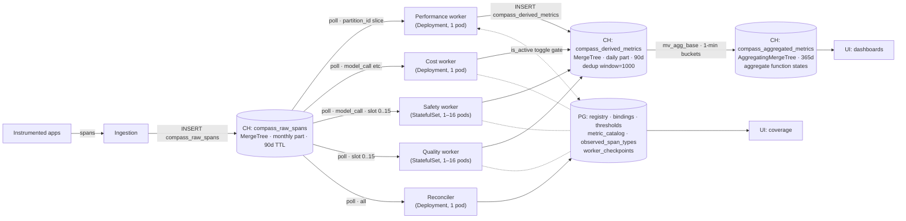
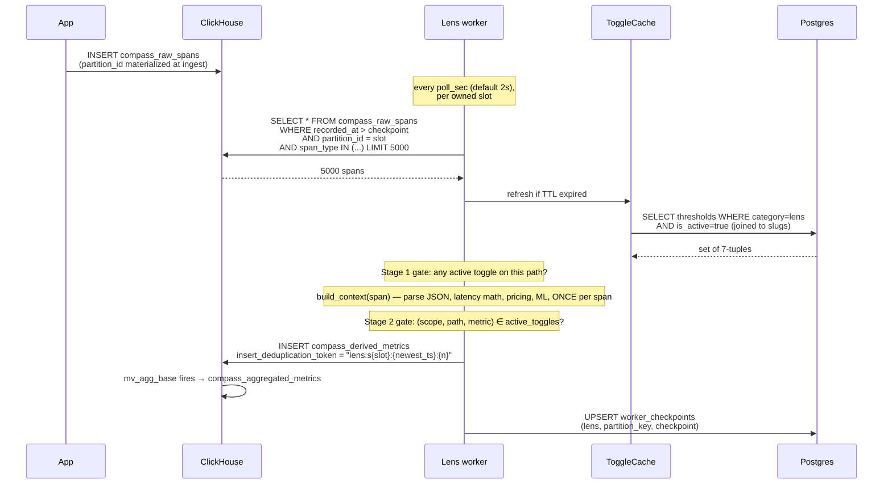
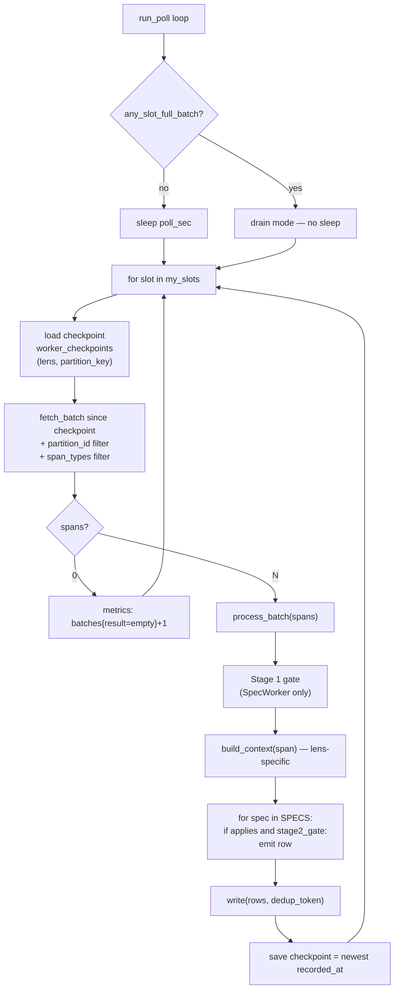
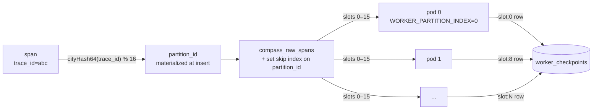

# Compass — Architecture

## 1. System context



## 2. Storage — two systems, one shape

| Store | Stores | Engine / mechanism |
|---|---|---|
| `compass_raw_spans` | What happened | CH MergeTree, monthly partition `toYYYYMM(started_at)`, 90d TTL, ORDER BY `(solution_id, span_type, started_at, trace_id, span_id)`, materialized `partition_id = cityHash64(trace_id) % 16` + set skip index |
| `compass_derived_metrics` | Per-span metric values | CH MergeTree, daily partition, 90d TTL, `non_replicated_deduplication_window = 1000` |
| `compass_aggregated_metrics` | 1-min rolled buckets | CH AggregatingMergeTree, monthly partition, 365d TTL, holds `AggregateFunction(avg/quantilesTDigest)` states |
| `solutions / endpoints / workflows / agents / components / bindings` | What exists | PG, UUID PKs, materialized-path on bindings |
| `thresholds` | Alert limits + per-(entity, metric, path) on/off switch | PG, scope_fk_validity CHECK |
| `worker_checkpoints` | Per `(lens, partition_key)` watermark | PG, UPSERT each batch |
| `metric_catalog` | Deploy-time metric → required span types + applicable scopes | PG, upserted at reconciler startup |
| `observed_span_types` | Applicability evidence | PG, written by reconciler |

### Materialized-path convention

```
solution_id → endpoint → workflow_id → agent_id → component_id → component_type
                                                                      ^ deepest
```

The deepest non-empty id is the target; higher levels are context. `path_cols(span, scope)` blanks ids deeper than the scope:

| scope | blanks |
|---|---|
| solution / endpoint | workflow, agent, component |
| workflow | agent, component |
| agent | component |
| component | — |

## 3. Span lifecycle



## 4. Worker engine



### Two-stage gate

| Stage | When | Drops if |
|---|---|---|
| 1 | Before `build_context` | No active toggle on this span's path (entire span discarded — saves PII / toxicity / NLI work) |
| 2 | After `build_context`, per spec | This (scope, path, metric) tuple absent from `ToggleCache.active` |

Both stages consult the same `ToggleCache` set.

## 5. Partition + slot model



Each pod owns a deterministic subset:

| Pod count | Pod 0 owns | Pod 1 owns | … |
|---|---|---|---|
| 1 | {0..15} | — | — |
| 2 | {0..7} | {8..15} | — |
| 4 | {0..3} | {4..7} | {8..11}, {12..15} |
| 8 | {0,1} | {2,3} | … |
| 16 | {0} | {1} | … |

Slot ownership is computed in `compass_worker.partition.compute_slots` — uneven divisions distribute the extra slots to low-index pods. Each slot has its own `worker_checkpoints` row keyed by `partition_key='slot:N'`; single-pod deployments use `partition_key='default'`.

**Scaling preserves checkpoints.** Slot checkpoints are independent of pod identity — `scale-safety.ps1 -Replicas 8` patches `replicas` AND `WORKER_PARTITION_COUNT` atomically; new pods inherit existing slot rows.

| Worker | Topology | Why |
|---|---|---|
| Reconciler | Deployment, replicas=1, strategy=Recreate | PG-bound, must not run concurrently |
| Performance | Deployment, replicas=1 | CPU-cheap |
| Cost | Deployment, replicas=1 | CPU-cheap |
| Safety | StatefulSet, 1–16 | Heavy ML — scale to keep checkpoint lag bounded |
| Quality | StatefulSet, 1–16 | Heavy ML (NLI + embedding + relevance) |

## 6. Caching layers

| Cache | Source | Lifetime | Where |
|---|---|---|---|
| `ToggleCache` | PG `thresholds` (is_active=true) | TTL `COMPASS_TOGGLE_TTL` (300s default) | All lens workers |
| `PricingCache` | PG `components.pricing` | TTL 300s | Cost worker |
| Slug→UUID | PG registry tables | Pod lifetime | Reconciler |
| Quality scorer LRU | (text_hash → score) | `COMPASS_QUALITY_CACHE_MAX` (20k default) | Quality worker |
| Safety PII LRU | (text_hash → pii_result) | `COMPASS_PII_CACHE_MAX` | Safety worker |
| Safety toxicity LRU | (text_hash → tox_result) | `COMPASS_TOXICITY_CACHE_MAX` | Safety worker |
| Model weights | HF download → image layer | Pod lifetime | Safety, Quality images |

All caches: first-load lock to avoid herding; subsequent reads lock-free (atomic ref swap on refresh). On PG / source failure: serve last good snapshot, raise on never-loaded.

## 7. Data correctness

| Guarantee | Mechanism |
|---|---|
| Append-only writes | Workers only INSERT into `compass_derived_metrics` |
| Idempotent under restart | Per-batch `insert_deduplication_token = "{lens}:s{slot}:{newest_recorded_at}:{batch_size}"` + CH `non_replicated_deduplication_window = 1000` — MV does NOT fire on a dropped insert |
| Per-lens isolation | Separate image, separate Deployment/StatefulSet, separate checkpoint rows |
| Slot watermarks survive scaling | Per-slot rows in `worker_checkpoints` keyed independently of pod identity |
| Single-writer per slot | StatefulSet ordinal + `WORKER_PARTITION_INDEX = ordinal` |

Not guaranteed: exactly-once across CH + PG (no shared txn), strict inter-batch ordering.

## 8. Observability

Prometheus metrics scraped from every worker on `:8080/metrics`:

| Metric | Labels |
|---|---|
| `compass_worker_batches_total` | `lens, slot, result` (success / empty / error) |
| `compass_worker_spans_processed_total` | `lens, slot` |
| `compass_worker_rows_emitted_total` | `lens, slot` |
| `compass_worker_batch_duration_seconds` | `lens, slot` |
| `compass_worker_write_duration_seconds` | `lens, slot` |
| `compass_worker_checkpoint_lag_seconds` | `lens, slot` — driver of HPA |
| `compass_reconciler_new_entities_total` | `entity_type` |
| `compass_reconciler_thresholds_seeded_total` | `lens, scope` |

Probes: `GET /healthz`, `GET /readyz` (set true after worker ready, false on shutdown).

## 9. Failure modes

| Failure | Outcome |
|---|---|
| Pod restarts mid-batch | No CH write happened (or dedup token catches the partial) → checkpoint didn't advance → next start re-fetches → no double-count |
| PG unreachable | `_refresh` raises if never loaded, else serves last snapshot + warns; checkpoint save fails → pod restart |
| CH unreachable | Fetch fails → exception → restart |
| Model files corrupt (Safety/Quality) | Readiness fails → no traffic → liveness fails → pod restart loop. Roll back image |
| Reconciler down | Workers keep emitting for already-known entities; new entities don't get registered or thresholds seeded until reconciler comes back |
| Slow batches | Checkpoint lag climbs; HPA on `compass_worker_checkpoint_lag_seconds` triggers scale-up (Safety / Quality) |

## 10. Read flow (UI)

```mermaid
flowchart LR
  ui[UI request<br/>"p95 latency, last 1h"] --> read["SELECT quantilesTDigestMerge(0.95)(quantiles)<br/>FROM compass_aggregated_metrics<br/>WHERE metric='latency' AND ts >= now()-1h<br/>GROUP BY toStartOfMinute(ts)"]
  read --> agg[("aggregated_metrics<br/>1-min buckets")]
  agg -->|merge states| result["[p50, p95, p99] per minute"]
  result --> ui
```

Aggregate function states (`avgState`, `quantilesTDigestState`) are merged at read time — selecting a state column raw returns binary garbage; always wrap with `*Merge`.

Coverage UI reads PG views directly — no aggregation layer. See `COVERAGE.md`.
