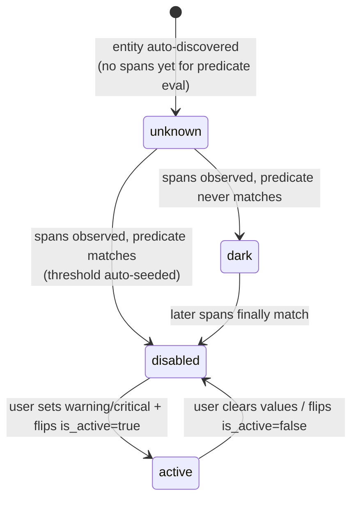
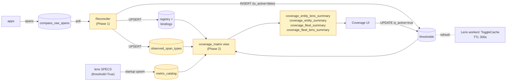
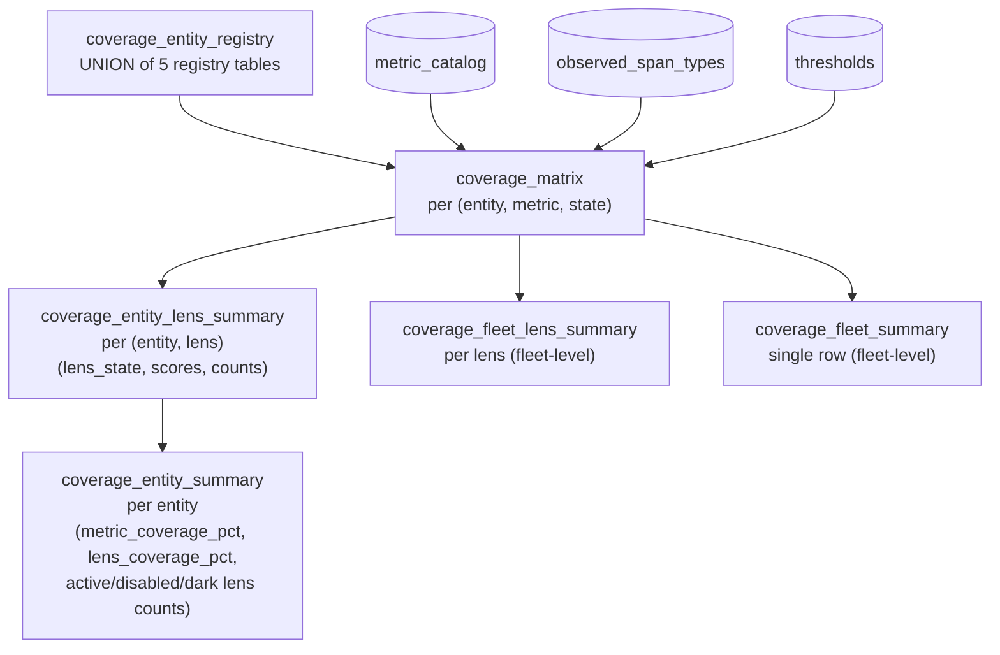
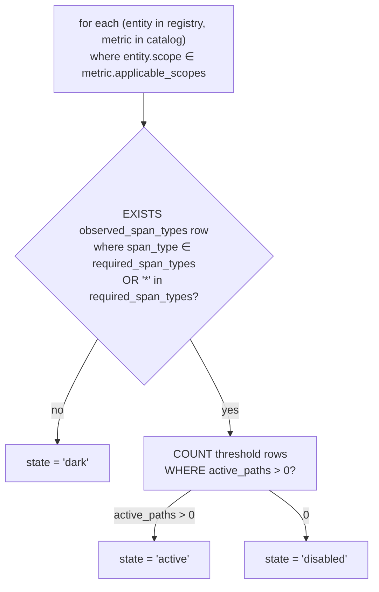
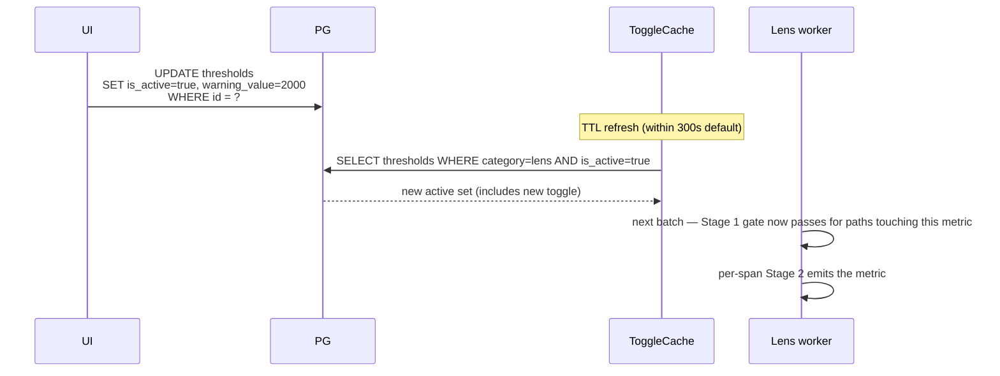

# Coverage — README

Exposes which lenses are wired vs dark across every entity in the registry. Two phases:

- **Phase 1** — reconciler worker auto-discovers entities, records evidence, seeds threshold rows. See [`reconciler.md`](reconciler.md) for the worker's internal architecture.
- **Phase 2** — SQL views derive `dark / disabled / active` per (entity, metric), plus rollups. UI reads directly. No new service.

## 1. The state model



| State | Cause | What worker does |
|---|---|---|
| **dark** | No `observed_span_types` for this entity intersects the metric's `required_span_types` | Nothing — the predicate physically can't match |
| **disabled** | Applicable, threshold row exists with `is_active=false` (reconciler auto-seeded default) | `ToggleCache` filters by `is_active=true` only → worker skips |
| **active** | User set values + flipped `is_active=true` | Worker emits derived rows on next batch |

## 2. End-to-end flow



## 3. Phase 1 — the three tables

### `metric_catalog` (rulebook)

One row per threshold-able metric across all lenses. Static; written by reconciler at startup from `lens SPECS`.

```sql
CREATE TABLE metric_catalog (
  metric              TEXT PRIMARY KEY,
  lens                threshold_category_enum,           -- performance|cost|safety|quality|outcomes
  required_span_types TEXT[],                            -- {'model_call'} | {'*'} | ...
  applicable_scopes   scope_level_enum[],                -- which scopes a threshold can sit at
  inputs              TEXT[],                            -- docs only
  unit                VARCHAR(32),
  default_window      VARCHAR(16),
  default_operator    VARCHAR(8) DEFAULT 'gt',
  created_at, updated_at  TIMESTAMPTZ
);
```

Source of truth for **what counts as applicable**.

### `observed_span_types` (evidence)

One row per `(entity_type, entity_id, span_type)` actually seen, recorded at **every level** of the path. Written by reconciler Phase 3; one `model_call` under a component creates 5 rows (component + agent + workflow + endpoint + solution).

```sql
CREATE TABLE observed_span_types (
  entity_type   scope_level_enum,
  entity_id     UUID,
  span_type     TEXT,
  first_seen    TIMESTAMPTZ,
  last_seen     TIMESTAMPTZ,
  sample_count  BIGINT,
  PRIMARY KEY (entity_type, entity_id, span_type)
);
```

Cardinality bounded by `entities × span_types` (~thousands of rows total). Source of truth for **what actually happens**.

### `thresholds` (existing — now also state)

The existing table from `00_schema.sql`. Phase 1 auto-seeds rows with `is_active=false`, NULL values, full materialized path populated from bindings (one row per distinct path the entity participates in).

| (entity, metric) cell value | Condition |
|---|---|
| dark | `observed_span_types` has no row matching `metric_catalog.required_span_types` |
| disabled | applicable + threshold row exists with `is_active=false` |
| active | ≥1 threshold row for this (entity, metric) has `is_active=true` (any-path-active rule) |

## 4. Phase 2 — the views



| View | Row grain | What the UI uses it for |
|---|---|---|
| `coverage_matrix` | (entity, metric) | Per-row state in the expanded matrix |
| `coverage_entity_lens_summary` | (entity, lens) | The 5 lens tiles per entity |
| `coverage_entity_summary` | entity | List rows, drill-down cards, fleet rollup |
| `coverage_fleet_lens_summary` | lens (fleet-wide) | Header per-lens tiles |
| `coverage_fleet_summary` | one row | Header "overall coverage" tile |

## 5. State derivation in SQL



### Per-lens roll-up

```sql
score_pct = 100 × active_metrics / (active_metrics + disabled_metrics)
            -- dark excluded from denominator (don't penalize for N/A)
lens_state = CASE
  WHEN applicable_metrics = 0       THEN 'dark'
  WHEN active_metrics > 0           THEN 'active'
  ELSE                                   'disabled'
END
```

### Per-entity roll-up

```sql
metric_coverage_pct = 100 × sum(active_metrics) / sum(active_metrics + disabled_metrics)
lens_coverage_pct   = 100 × active_lenses / (active_lenses + disabled_lenses)
```

Two scores: metric_coverage is granular, lens_coverage is the coarser 5-tile view.

## 6. Install + verify

```bash
psql "$PG_DSN" -f infra/postgres/init/04_coverage_phase1.sql
psql "$PG_DSN" -f infra/postgres/init/05_coverage_views.sql
```

Both idempotent (`CREATE TABLE IF NOT EXISTS`, `CREATE OR REPLACE VIEW`).

```sql
-- 1. Catalog populated
SELECT lens, COUNT(*) FROM metric_catalog GROUP BY lens ORDER BY lens;

-- 2. Evidence per entity
SELECT entity_type, COUNT(*) AS rows
  FROM observed_span_types GROUP BY entity_type;

-- 3. Threshold seeding (all should be is_active=false before user action)
SELECT category, scope,
       COUNT(*) FILTER (WHERE NOT is_active) AS disabled,
       COUNT(*) FILTER (WHERE is_active)     AS active
  FROM thresholds GROUP BY category, scope ORDER BY category, scope;

-- 4. Views work
SELECT state, COUNT(*) FROM coverage_matrix GROUP BY state;
SELECT * FROM coverage_fleet_summary;
SELECT * FROM coverage_fleet_lens_summary ORDER BY lens;
```

## 7. Loop closure — UI activates a metric



## 8. Caches / scaling implications

| Cache | Why coverage cares |
|---|---|
| Reconciler slug→UUID | Phase 1 idempotency at scale; pod restart-safe |
| Reconciler `metric_catalog` | Cached after startup upsert; doesn't change at runtime |
| ToggleCache (per lens) | TTL 300s = max delay between "user activates metric" and "worker starts emitting" |
| Coverage views | No materialized cache today — computed on every query. Views are cheap (joins on indexed columns); upgrade to materialized views if read rate becomes an issue |

## 9. Files

| File | Purpose |
|---|---|
| `infra/postgres/init/04_coverage_phase1.sql` | `metric_catalog` + `observed_span_types` tables |
| `infra/postgres/init/05_coverage_views.sql` | 6 views (Phase 2) |
| `compass-workers/compass_worker/catalog.py` | `PREDICATE_INFO` + `upsert_metric_catalog` |
| `compass-workers/compass_worker/reconciler.py` | `ReconcilerWorker` (Phase 1) |
| `compass-workers/Dockerfile.reconciler` | reconciler image |
| `infra/k8s/22_deployment-reconciler.yaml` | K8s manifest |
| `compass-workers/compass_coverage/` | Python helper module (optional — UI can call PG directly) |
| `compass-coverage-ui-queries.md` | Hand-off SQL for the UI team |

## 10. UI handoff

UI team queries PG directly via `compass-coverage-ui-queries.md`. The drill-down hierarchy:

```
Fleet header (§1)
  ↓
Solutions list (§2)
  ↓
Solution detail (§3): 5 lens tiles + endpoints list
  ↓
Endpoint detail (§4): 5 lens tiles + workflows
  ↓
Workflow detail (§5): 5 lens tiles + agents
  ↓
Agent detail (§6): 5 lens tiles + components
  ↓
Component detail (§7): 5 lens tiles + full matrix
  ↓
Expand a metric row (§9): paths it participates in
  ↓
Activate / deactivate button (§11): UPDATE thresholds
```

Whatever process serves the UI today calls PG directly. No new HTTP service. The Python helper in `compass_coverage/` is an alternative for Python consumers.

## 11. What's deferred

- **Reconciler lag indicator** — surface `compass_reconciler_new_entities_total` rate in the UI header so operators can spot the reconciler falling behind.
- **NOTIFY/LISTEN on thresholds** — push toggle changes to ToggleCache instead of waiting for TTL. Closes "5-min delay" UX gap.
- **Backfill script** — one-shot to rebuild `observed_span_types` from the full 90d CH retention window if the reconciler is deployed against an existing system.
- **Materialized coverage_matrix** — if read rate on the views gets heavy.
- **Outcomes lens specs** — `metric_catalog` will be empty for outcomes until the lens ships.
