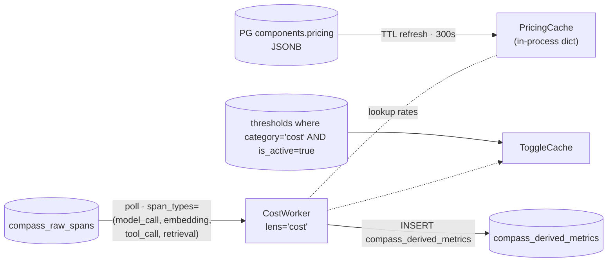
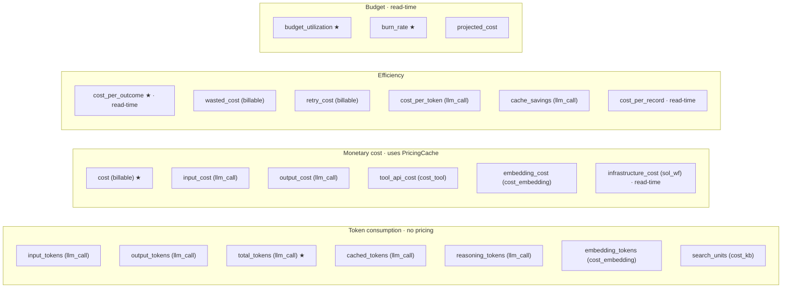
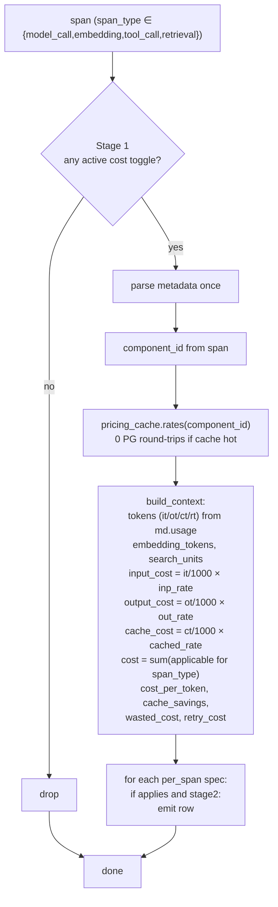
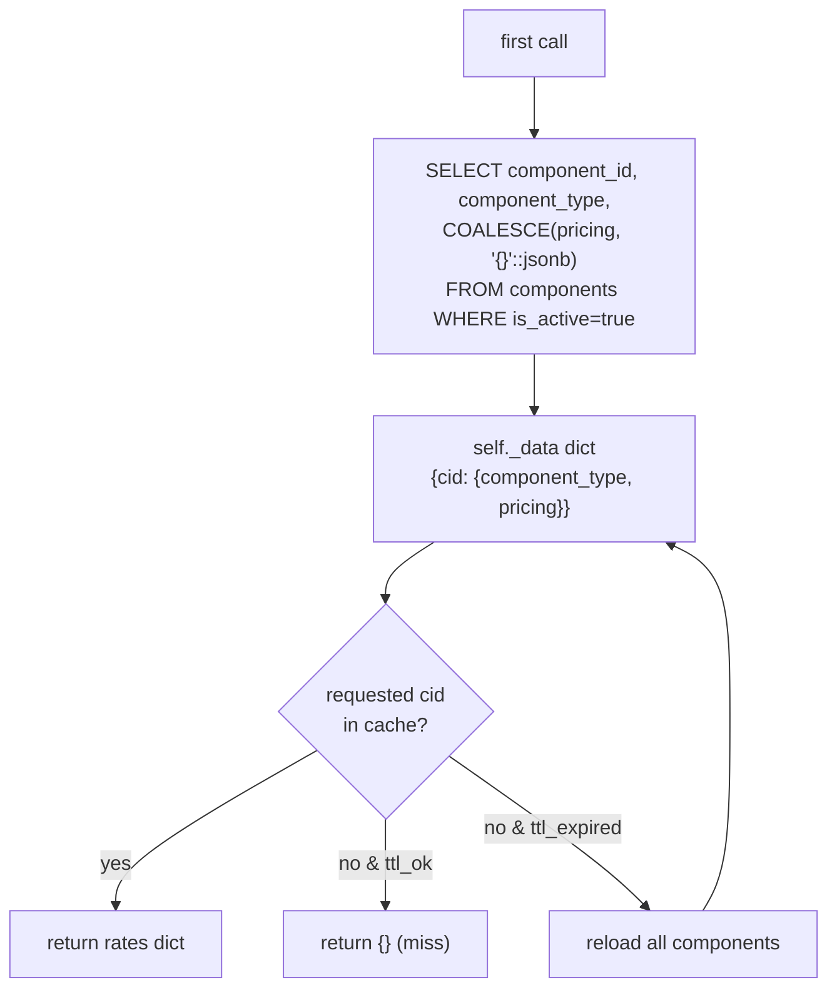
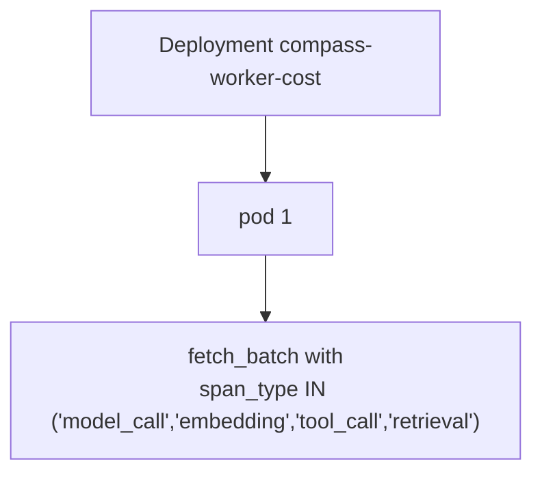

# Cost Lens — Architecture

22 metrics. CPU-cheap. Only difference from Performance: a PG-backed `PricingCache` for component rates.

## 1. Position



**Pre-filter at CH.** `span_types = ('model_call', 'embedding', 'tool_call', 'retrieval')` — pushed into the `fetch_batch` SQL via `AND span_type IN (...)`. The CH order key has `span_type` second, so the filter is a range scan, not a table scan. Spans that can't possibly produce cost (solution/workflow/agent infrastructure spans) never leave CH.

## 2. Metrics



★ = `threshold=True` (gets seeded by reconciler).

## 3. Per-span flow



**`cost` is additive, not per-span at parent scopes.** Solution / endpoint / workflow / agent rows for `cost` are computed at READ TIME by summing `compass_aggregated_metrics.sum_value` over the path. The worker never emits a solution-scoped cost row — it would double-count when rolled up.

## 4. PricingCache



Pricing JSON shapes (per `component_type`):

| Type | Keys |
|---|---|
| `model` | `input_per_1k`, `output_per_1k`, `cached_input_per_1k` |
| `tool` | `per_call` |
| `knowledgebase` | `per_query` |
| `skill / function / memory` | `{}` (no direct monetary cost) |

| Knob | Default |
|---|---|
| TTL | 300s |
| Source | `PostgresPricingSource` |
| Refresh on miss | No — relies on TTL refresh to pick up new components |
| On PG outage | Serve last snapshot, warn. Raise if never loaded |

A newly-added component without a cached entry yields `cost = 0.0` for up to one TTL — acceptable for a system where new components are rare and the operator can `kubectl rollout restart` for an immediate refresh.

## 5. ToggleCache

Same as every lens. `category='cost'`, TTL 300s. Cache key includes the full materialized path; the Reconciler seeds threshold rows with the full path populated (so Stage 1 + Stage 2 set-membership matches what spans carry).

## 6. Topology



| Knob | Value |
|---|---|
| Image | `compass-worker:cost` (~400 MB, same content as `:base`) |
| Replicas | 1 |
| `WORKER_PARTITION_COUNT` | unset |
| `span_types` filter | `('model_call', 'embedding', 'tool_call', 'retrieval')` — pushed into CH query |
| Resources | 100m–500m / 256–512Mi |

The CH-side span_types filter skips probably 30–60% of spans (depends on workload shape — every workflow/agent/solution span is dropped). Together with the small per-span work, single pod handles tens of thousands of spans per second.

## 7. Failure modes

| Failure | Outcome |
|---|---|
| Pricing missing for a component | `cost = 0.0` for that component until pricing added + TTL expires (or pod restart) |
| Component's pricing JSON malformed | `PostgresPricingSource.load` parses with `json.loads` if not already dict; raises on bad JSON → first refresh after the bad row fails → serves last good snapshot. Operator must fix PG row |
| `is_active=false` on a component | Excluded from `PostgresPricingSource.load` — its `cost = 0.0` until reactivated |
| Span has token usage but missing component_id | `rates = {}` → cost = 0.0 (no rates to apply) |

## 8. Read-time metrics

`per_span=False` metrics don't write to `compass_derived_metrics`. They're computed from `compass_aggregated_metrics`:

```sql
-- 1h burn rate at solution scope
SELECT solution_id,
       sum(sum_value) AS spend_usd,
       sum(sum_value) AS burn_per_hour
FROM compass_aggregated_metrics
WHERE scope = 'solution' AND metric = 'cost'
  AND ts >= now() - INTERVAL 1 HOUR
GROUP BY solution_id;

-- cost_per_outcome (assuming an "outcomes" counter metric exists)
SELECT solution_id,
       sum(cost_sum) / nullif(sum(outcomes_sum), 0) AS cost_per_outcome
FROM (
  SELECT solution_id,
         sumIf(sum_value, metric='cost')      AS cost_sum,
         sumIf(sum_value, metric='outcomes')  AS outcomes_sum
  FROM compass_aggregated_metrics
  WHERE scope='solution' AND ts >= now() - INTERVAL 1 DAY
  GROUP BY solution_id
);
```

These metrics still get threshold rows seeded by the reconciler (any `threshold=True` spec does); evaluation is the read-side / alerter's job.

## 9. Adding a cost metric

```python
# lenses/cost.py SPECS
_spec("new_cost_metric", billable, ctx_value("new_value"),
      ["component_id", "metadata.usage.new_field"], "USD", "1d", threshold=True),
```

If the new metric needs new pricing fields, update `components.pricing` JSON shape AND `build_context` to compute the value into ctx. PricingCache picks up new fields without code changes — it loads the JSON verbatim.
