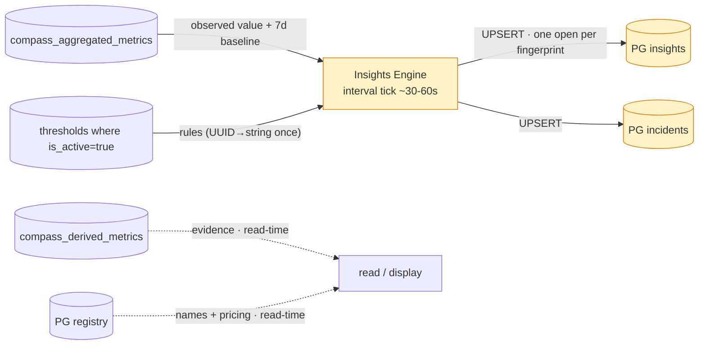
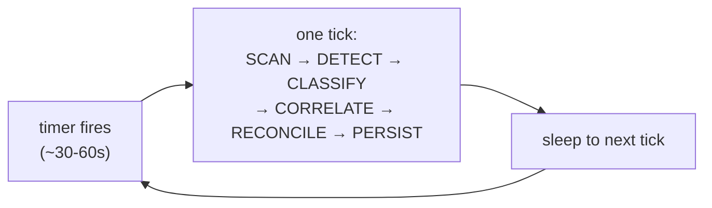
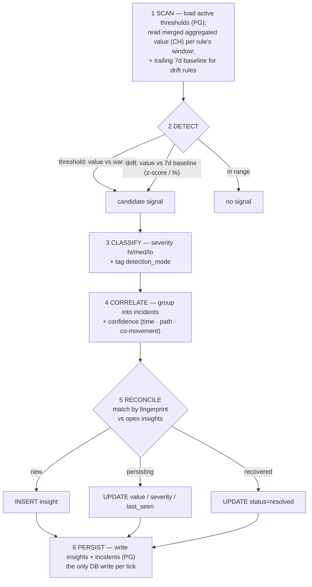
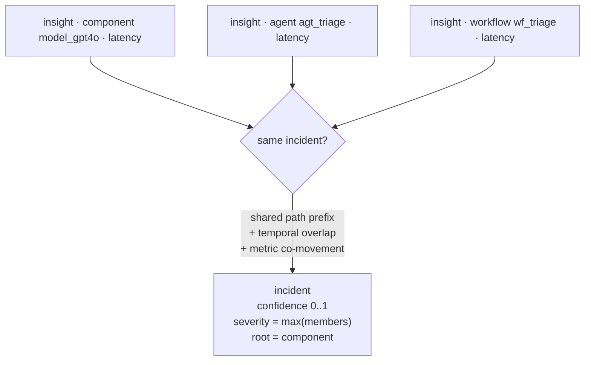
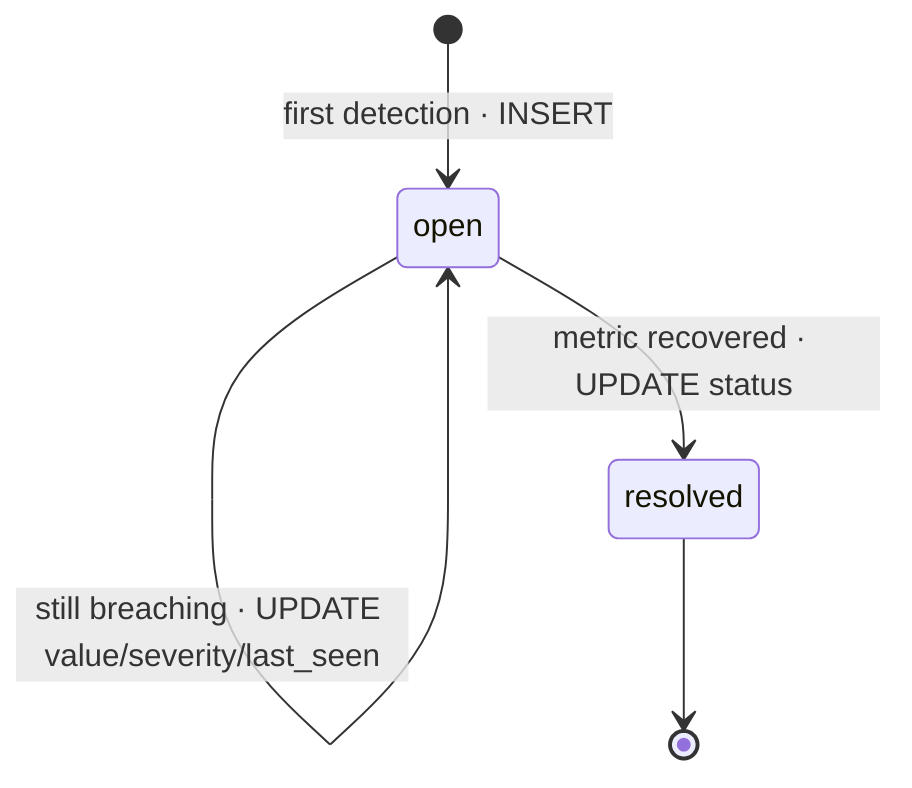
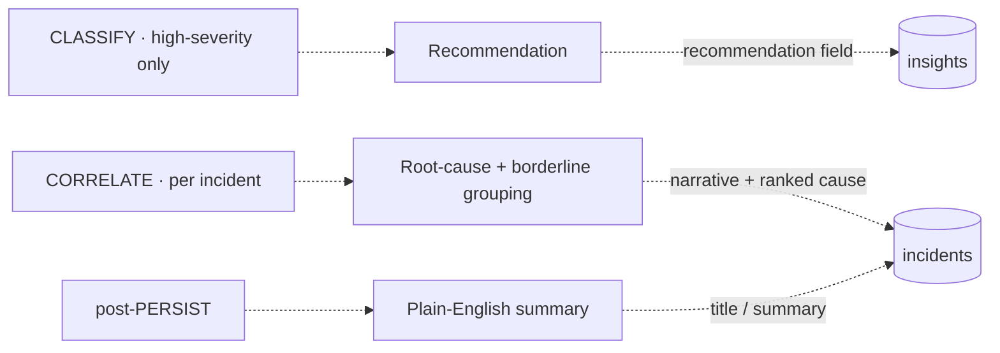
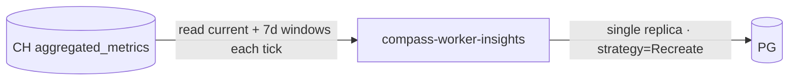

# Insights Engine — Architecture

Turns rolled-up metrics into prioritized **insights** and groups correlated ones into
**incidents**. Read-only on ClickHouse + Postgres rules; write-only on the Postgres
`insights` / `incidents` tables. A separate worker, but **interval-driven** (evaluates
current state every ~30–60s), not watermark-driven like the lenses.

High-resolution diagrams for slides live in [`docs/insights/`](./insights/) (`architecture`,
`engine-llm`, `entities`, `dataflow` as `.png` + `.mmd`).

## 1. Position in the system



Yellow = new for the insights feature. The engine's **detection hot path reads only
two inputs**: `compass_aggregated_metrics` (CH) and `thresholds` (PG). The registry
(names, pricing) and `derived_metrics` (per-span evidence) are **read-time** concerns
— resolved when something is displayed, never on the detection path. That's why there
is no enrichment stage in the engine.

## 2. The tick — interval-driven, not watermark-driven



The lenses consume a **stream** of new spans (watermark on `recorded_at`). The engine
instead **evaluates the current state** of metrics against rules: each tick re-reads
the same recent windows and asks "what's breached *right now*?". It needs no cursor —
if a tick is skipped, the next tick still sees the current state and re-fires. Its
durability is the **reconciled `insights` table**, not a checkpoint.

### Why a timer, not "trigger after each lens batch"

- **The data only refreshes once a minute.** `aggregated_metrics` is a 1-minute base
  grain, so re-evaluating faster than ~1/min reads the *same* values — no fresher
  signal exists to react to. A ~30–60s timer is already as fresh as the data gets.
- **Lens workers never "finish."** They poll continuously (~2s/batch) and there are
  4–5 of them — so "after a lens batch" means firing many times per second. You'd have
  to debounce it back down to ~1/min, which is just a timer with extra wiring.
- **A timer keeps the engine isolated.** No coupling to the lenses, no signal bus —
  consistent with the per-component isolation the rest of the system is built on.
- **Optional idle skip:** to avoid re-evaluating when nothing changed, the tick can
  first check "has any bucket advanced since last tick?" (`MAX(ts)`) and skip if not —
  the "don't waste work" benefit without coupling to the lenses.

Event/push-driven becomes the better fit only if ingestion later goes **streaming**
with a sub-second grain (NATS streaming is listed as future work); with today's
1-minute grain, the interval timer is the right model.

## 3. Per-tick flow



The core is deterministic math. The LLM layer (§7) is optional and hangs off
CLASSIFY / CORRELATE / PERSIST.

## 4. Detection modes (two)

| Mode | Logic | "Past data" |
|---|---|---|
| **threshold** | merge the aggregated value over the rule's `time_window`, compare vs `operator` + `warning_value`/`critical_value`. Severity from which bound is crossed. | none — fixed rule |
| **baseline drift** | compare the current window vs a **trailing 7-day baseline** (same metric, wider CH query) → z-score / % deviation. | CH `aggregated_metrics`, wider `ts` range |

The baseline read is **issued in SCAN** (batched with the current window) and
**consumed in DETECT**. The engine stores no history of its own — ClickHouse retains
it (365-day TTL), so "past data" is just a wider time-range query each tick.

> **Baseline window is hardcoded 7d for v1.** A per-rule `baseline_window` knob (a
> nullable column on the rules config, defaulting to 7d) is a purely-additive future
> change. *Gate-failure* was considered as a third mode and dropped — error-rate and
> quality metrics already cover those cases as thresholds.

## 5. Correlation & incidents



CORRELATE works on the insights produced **this tick** (plus still-open ones) — it
does *not* look at metric history (that's drift). The materialized path is the spine:
a `component` insight + its parent `agent`/`workflow` share a path prefix, using the
string-id path already on the metric. **Confidence (0–1)** is a weighted blend of
temporal overlap, path ancestry, and co-movement.

## 6. Reconciliation & lifecycle



Each tick, RECONCILE matches candidates against the **open** insights in Postgres by a
**fingerprint** = `lens + detection_mode + entity path + metric + window`. A partial
unique index enforces **one open insight per fingerprint**, so re-evaluation upserts
the same row instead of creating duplicates. This is what makes insights "update when
metrics change."

## 7. LLM enrichment layer (Claude) — optional



Follows the repo's existing expensive-analysis pattern (`PrefillStep`): **gated,
cached, batched, async** — only high-severity insights + incident-level, cache by
content hash, off the detection path. Default `claude-opus-4-8` for judgment-heavy
jobs (root-cause, grouping), `claude-haiku-4-5` for high-volume summaries, structured
outputs so results come back as validated JSON. The engine is fully functional
without this layer; it only makes insights richer.

## 8. Storage

Two tables (triage deferred — see §12). String-id path, not readable names; no raw
spans (those are read-time).

| Table | Key columns |
|---|---|
| **`insights`** | `fingerprint`, `lens`, `detection_mode` (threshold/drift), `severity`, `status` (open/resolved); path: `scope`, `solution_id`…`component_id`, `component_type`, `environment`; signal: `metric`, `time_window`, `operator`, `observed_value`, `threshold_value`, `baseline_value`, `deviation`, `threshold_id` (FK); `recommendation`, `details` (JSON); lifecycle: `first_seen`, `last_seen`, `resolved_at`; `incident_id` (FK) |
| **`incidents`** | `confidence` (0–1), `severity` (max of members), `status`, `root_scope`/`root_entity`, `member_count`, `title`/summary (LLM), `details` (JSON), `opened_at`, `resolved_at` |

```sql
-- one open insight per signal — reconciliation upserts on this
CREATE UNIQUE INDEX uq_insights_open_fingerprint
  ON insights (fingerprint) WHERE status = 'open';
```

## 9. Topology + scaling



| Knob | Value | Why |
|---|---|---|
| `replicas` | 1 | two engines race on the fingerprint upsert / double-write |
| `strategy` | Recreate | single writer — old pod terminated before new starts |
| Trigger | interval timer (~30–60s) | evaluates current state, not a stream |
| `WORKER_PARTITION_COUNT` | unset | reads aggregated metrics globally |
| Resources | ~100m–500m CPU, 256–512Mi | CH/PG-bound, not CPU-bound (LLM calls are async/out-of-band) |
| Probes | `/healthz`, `/readyz` at :8080 | same as the lens workers |

Cadence floor is ~30–60s: the base grain is 1 minute, so ticking faster just re-reads
the same buckets.

## 10. Observability

Adds to the standard worker metrics (proposed):

| Metric | Labels | Meaning |
|---|---|---|
| `compass_insights_tick_duration_seconds` | — | wall-clock per evaluation tick |
| `compass_insights_open` | `lens, severity` | gauge of currently-open insights |
| `compass_insights_opened_total` / `_resolved_total` | `lens` | lifecycle transitions |
| `compass_incidents_open` | — | gauge of open incidents |
| `compass_insights_llm_calls_total` | `job, model` | enrichment calls (root-cause / summary / recommendation) |

`compass_insights_tick_duration_seconds` climbing, or `_open` growing without bound,
are the main health signals.

## 11. Failure modes

| Failure | Outcome |
|---|---|
| ClickHouse unreachable | tick fails, retries next tick. Stateless — no data loss; open insights stay as last persisted |
| Postgres unreachable on PERSIST | tick errors, retries next tick. Open insights remain as-is until a successful tick reconciles |
| LLM call fails / times out | enrichment is best-effort + async — insight/incident still persists **without** recommendation/summary; retried on a later tick |
| Duplicate detection within a tick | `uq_insights_open_fingerprint` dedups → one open row |
| Two engines running (manual `kubectl scale`) | unique index serializes the upserts; **strategy=Recreate prevents it** |
| Garbage metric value (e.g. negative latency from a partial span) | could fire a false insight — guard upstream in the lens; optional engine-side sanity floor as defense-in-depth |

## 12. Scope (v1)

**In:** separate interval-driven worker; two detection modes (threshold + drift, 7d
baseline); correlation into incidents with a confidence score; reconciliation via
fingerprint; `insights` + `incidents` storage; optional Claude enrichment.

**Out (deferred — all purely additive later):** no API/UI; no **triage**
(claim/snooze/mute/false-positive — meaningless without a UI); no **ENRICH** stage
(names/pricing read-time); no **gate-failure** mode (covered by thresholds); no
per-rule **`baseline_window`** (hardcoded 7d).
