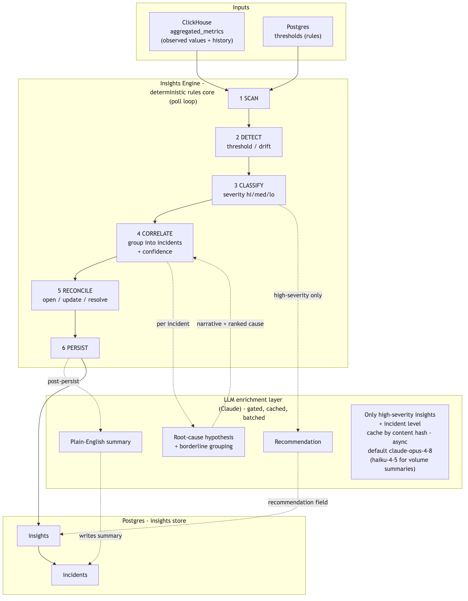

# Insights Engine — Engine + LLM Enrichment

This document explains [`engine-llm.png`](./engine-llm.png) (source: [`engine-llm.mmd`](./engine-llm.mmd)).

## The one-line story

The Insights Engine is a **deterministic rules core** that turns metrics into
prioritized insights and incidents. It reads observed values from ClickHouse,
compares them against rules in Postgres, groups correlated signals into incidents,
and writes the results back to Postgres. An **optional LLM (Claude) enrichment
layer** hangs off the high-value stages to add human-readable summaries,
root-cause hypotheses, and recommendations — gated so it never sits on the fast path.

The diagram has four bands, top to bottom: **Inputs → Engine → LLM layer → Output store.**

---

## 1. Inputs (top band)

The engine's detection hot path reads only **two** inputs. It creates nothing here.

| Entity | Store | What it provides | Why the engine needs it |
|---|---|---|---|
| **`aggregated_metrics`** | ClickHouse | The pre-rolled time series — per `(scope, entity path, metric, 1-min bucket)`: count, sum, min/max, averages, and tdigest quantiles. Merged on read up to any window. **Already carries the materialized path** (string ids) used for filtering and incident grouping. | The **observed value** an insight is about ("p95 latency = 4100ms over 5m"), plus the **history** used to compute baselines for drift, plus the **path** for correlation. |
| **`thresholds` (rules)** | Postgres | Per metric/entity: `operator` (gt/lt), `warning_value`, `critical_value`, `time_window`, `category` (= lens). | The **rule** that turns a number into an insight, and the severity bound it crosses. `time_window` tells the engine how far to merge in ClickHouse. |

> The Postgres **registry** (entity names, pricing) is **not** read in the detection
> hot path. The materialized path comes from ClickHouse, so the engine doesn't need
> the registry to detect, classify, group, or resolve. Human-readable names and
> pricing are resolved lazily at **read/display time** with a join on the string ids.
>
> Cross-store note: ClickHouse carries **string ids** (`sol_support`, `agt_triage`);
> Postgres `thresholds` use registry **UUIDs**. The engine resolves UUID→string once
> when loading rules (the existing `toggle_cache` already does this join).

---

## 2. The Insights Engine — deterministic rules core (middle band)

A poll loop (`load checkpoint → evaluate → write → checkpoint`, same shape as the
lens workers) running six stages. Everything here is mechanical math — no LLM
required for the engine to function.

| Stage | Name | What it does |
|---|---|---|
| **1** | **SCAN** | Load active thresholds (PG) and read the merged aggregated value (CH) for each entity / metric / window. |
| **2** | **DETECT** | Apply the two detection modes and emit candidate signals: **threshold** (value vs warning/critical), **baseline drift** (current window vs trailing history → z-score / % deviation). |
| **3** | **CLASSIFY** | Assign **severity** — crossing `critical` → `high`, `warning` → `medium`, drift magnitude → graded — and tag the detection mode. |
| **4** | **CORRELATE** | Cluster correlated candidates into **incidents** and compute a **confidence score** — a weighted blend of temporal overlap, path ancestry (a component insight + its parent agent/workflow share a path prefix, using the string-id path already on the metric), and metric co-movement. |
| **5** | **RECONCILE** | Diff candidates against currently-open insights: open new ones, update the live value/severity on persisting ones, auto-resolve ones whose metric has recovered. This is what makes insights "update when metrics change." |
| **6** | **PERSIST** | Write insights + incidents to Postgres. |

> **No ENRICH stage.** Earlier designs had a stage that joined the registry for
> readable names/pricing. It was removed: the path the engine needs comes from
> ClickHouse, and names/pricing are display concerns resolved at read time. The
> insight stores the raw string-id path; a consumer joins the registry only when
> rendering.

> **Baseline window — hardcoded 7d default for v1.** Drift detection compares the
> current window against a trailing baseline. The current window comes from the
> rule's `time_window`, but how far back the baseline reaches is **not** configurable
> in v1 — it's a hardcoded **7-day** trailing window in the engine, applied to all
> drift rules. A per-rule `baseline_window` knob can be added later (a nullable
> column on the rules config, defaulting to 7d) if different metrics need different
> lookbacks — purely additive, no rework.

---

## 3. LLM enrichment layer (Claude) — optional, gated

This layer is **not required** for detection. It bolts onto the high-value stages
to make insights *richer*, and follows the repo's existing expensive-analysis
pattern (the `PrefillStep` used by Safety/Quality): **gated, cached, batched, async.**

| Job | Hooks into | What it produces |
|---|---|---|
| **Recommendation** | Stage 3 CLASSIFY (high-severity insights) | The `recommendation` field — concrete next steps derived from the metric, entity, and history. Keyed on **severity**, not on a stage. |
| **Root-cause hypothesis + borderline grouping** | Stage 4 CORRELATE | A narrative + ranked likely cause for an incident, and a yes/no judgment on whether two ambiguous signals belong to the same incident (beyond the mechanical confidence score). |
| **Plain-English summary** | post-Stage 6 PERSIST | A human-readable summary written onto the incident. |

**Gating discipline (the `NOTE` box in the diagram):**

- **Only high-severity insights + incident-level** calls — never per raw signal. Mechanical detection stays the fast path.
- **Cache by content hash** (same approach as `_prefill_cache`) so repeated signals don't re-pay.
- **Async** — runs off the detection hot path so a slow LLM never stalls reconciliation.
- **Model default `claude-opus-4-8`** for the judgment-heavy jobs (root-cause, grouping); **`claude-haiku-4-5`** for high-volume per-insight summaries. Use **structured outputs** so results come back as validated JSON the engine stores directly.

> The seam already exists: the quality lens's `QualityScorer` interface explicitly
> anticipates "an LLM judge" as a drop-in backend, so this layer plugs in without
> changing the engine.

---

## 4. Output store — Postgres (bottom band)

Insights are mutable, stateful records (lifecycle), so they live in
Postgres (ClickHouse stays append-only).

| Entity | What it holds |
|---|---|
| **`insights`** | One prioritized signal per `(lens, detection_mode, entity path, metric, window)`. Carries severity, status (open/resolved), the observed value, the crossed threshold, the materialized path (string ids), and `incident_id`. One **open** insight per signal (enforced by a partial unique index on the fingerprint). |
| **`incidents`** | A group of correlated insights with a computed **confidence score**, a severity (max of members), a suspected root entity, and — optionally — the LLM-written summary. |

> **Triage deferred.** Claim / snooze / mute / false-positive is a human-interaction
> layer that's meaningless without an API/UI for people to act through. It's in the
> overall spec but **out of scope for now** — it's a purely additive change (new
> tables + a few nullable columns) to add when the API lands. The engine and the
> insights/incidents storage stand alone without it.

---

## How to read the arrows

- **Solid arrows** = the deterministic data flow (inputs → engine stages → store).
- **Dotted arrows** = the optional LLM hops: CLASSIFY (high-severity) → Recommendation,
  CORRELATE → Root-cause, PERSIST → Summary, and the results flowing back
  (recommendation onto the insight, narrative onto the incident, summary written to
  the incident).

The takeaway: **the engine works fully on its own (CH values × PG rules → insights
→ incidents); the Claude layer is enrichment bolted on at the points where natural
language adds the most value.**
