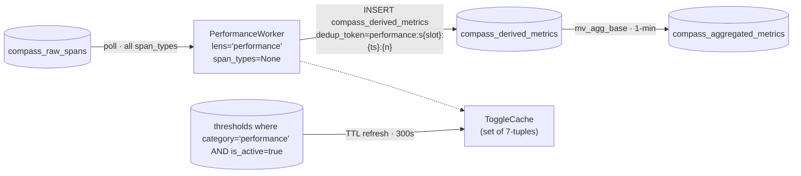
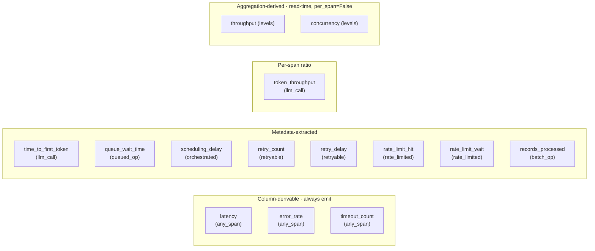
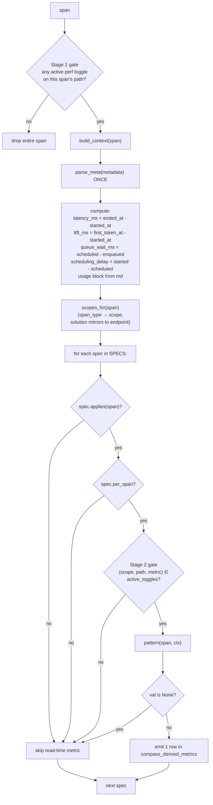
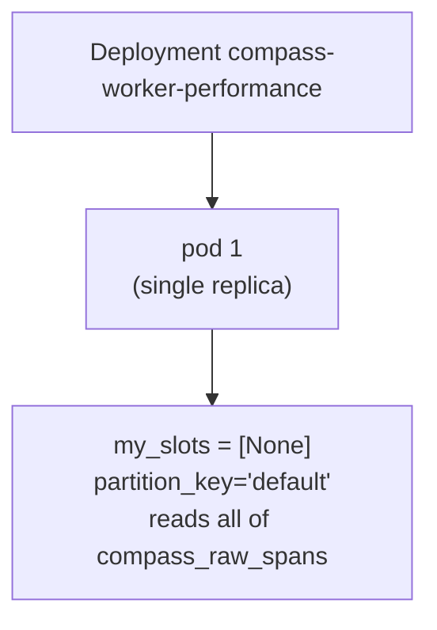

# Performance Lens — Architecture

17 metrics. CPU-cheap. No ML, no external dependencies beyond CH + PG. Reference implementation of the `SpecWorker` engine.

## 1. Position



## 2. Metrics



`threshold=True` metrics (Phase 1 seeds these into `thresholds`): `latency`, `error_rate`, `time_to_first_token`, `retry_count`, `throughput`.

## 3. Per-span compute



`build_context` runs **once per span** — every spec reads off `ctx`. That's the efficiency idea: parse metadata once, do latency math once.

`pattern(span, ctx)` returning `None` means "nothing to emit" (missing metadata key, divide-by-zero guard) — engine skips silently. No error rows.

## 4. Patterns used

| Pattern | Returns | Used by |
|---|---|---|
| `column_latency()` | `ended_at - started_at` ms | `latency` |
| `status_flag({set})` | 1 if `span_status` in set else 0 | `error_rate`, `timeout_count` |
| `metadata_numeric(key)` | numeric from JSON metadata | `retry_count`, `retry_delay`, `rate_limit_wait`, `records_processed` |
| `metadata_bool(key)` | 1.0/0.0 from JSON bool | `rate_limit_hit` |
| `ratio(num_fn, den_fn)` | num/den, None on zero | `token_throughput` |
| `ctx_value(field)` | `ctx[field]` | TTFT, queue_wait, scheduling_delay |
| `aggregation_derived()` | marker — always None | `throughput`, `concurrency` (read-time) |

## 5. Read-time metrics

`per_span=False` metrics never write to `compass_derived_metrics`. They're computed at read time from `compass_aggregated_metrics`:

```sql
-- throughput: rate of spans in a window
SELECT toStartOfMinute(ts) AS m, sum(count) / 60.0 AS ops_per_sec
FROM compass_aggregated_metrics
WHERE solution_id = ? AND metric = 'latency'  -- any metric we know was emitted
  AND ts >= now() - INTERVAL 1 HOUR
GROUP BY m;

-- concurrency: overlapping spans in a window
SELECT toStartOfMinute(ts) AS m,
       avgMerge(avg_value) * (sum(count) / 60.0) AS active_spans
FROM compass_aggregated_metrics
WHERE solution_id = ? AND metric = 'latency'
GROUP BY m;
```

These metrics still get threshold rows seeded by the reconciler (any `threshold=True` metric does). The alerting layer (read-side) is what checks them; the worker never emits or gates on them.

## 6. Caching

| Cache | TTL |
|---|---|
| `ToggleCache` (perf toggles only) | `COMPASS_TOGGLE_TTL` = 300s |

That's it. No pricing, no ML, no per-text dedup. The worker is stateless beyond the toggle cache.

## 7. Topology + scaling



| Knob | Value |
|---|---|
| Image | `compass-worker:performance` (~400 MB, same content as `:base`) |
| Replicas | 1 |
| `WORKER_PARTITION_COUNT` | unset → unpartitioned |
| `span_types` filter | `None` (reads every span — `latency`/`error_rate` apply to all) |
| Resources | 100m–500m CPU, 256–512Mi memory |
| Probes | `/healthz`, `/readyz` at :8080 |

Single pod is plenty — context_builder is ~10 µs per span, and most spans pass Stage 1 instantly (set membership). The Performance worker rarely shows up in lag dashboards.

## 8. Failure modes

| Failure | Outcome |
|---|---|
| `metadata` JSON parse failure | `parse_meta` returns `{}`; specs that need it return None and silently skip. No crash |
| Span has `ended_at < started_at` | `column_latency` returns negative number — surfaces as anomaly in dashboards |
| ToggleCache PG unreachable | Serves last snapshot; warns. If never loaded, raises on first batch — pod restart loop until PG back |

## 9. Adding a performance metric

Add one line to `lenses/performance.py`:

```python
_spec("new_metric", llm_call, metadata_numeric("usage.new_field"),
      ["metadata.usage.new_field"], "count", "5m", threshold=True),
```

Steps:

1. If the predicate is new, register it in `predicates.py` AND in `compass_worker/catalog.py` `PREDICATE_INFO`.
2. Add it to `SPECS`.
3. Redeploy reconciler — picks up `metric_catalog` change, seeds thresholds.
4. Redeploy performance worker — picks up new spec.
5. Validate offline with `--csv` first.

If `threshold=True`, the reconciler will start auto-seeding it next batch.
