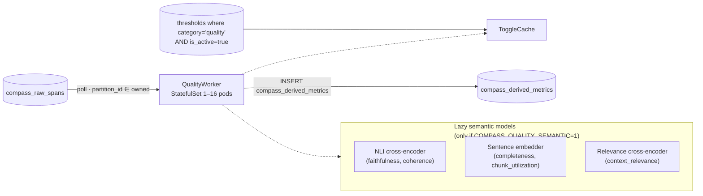
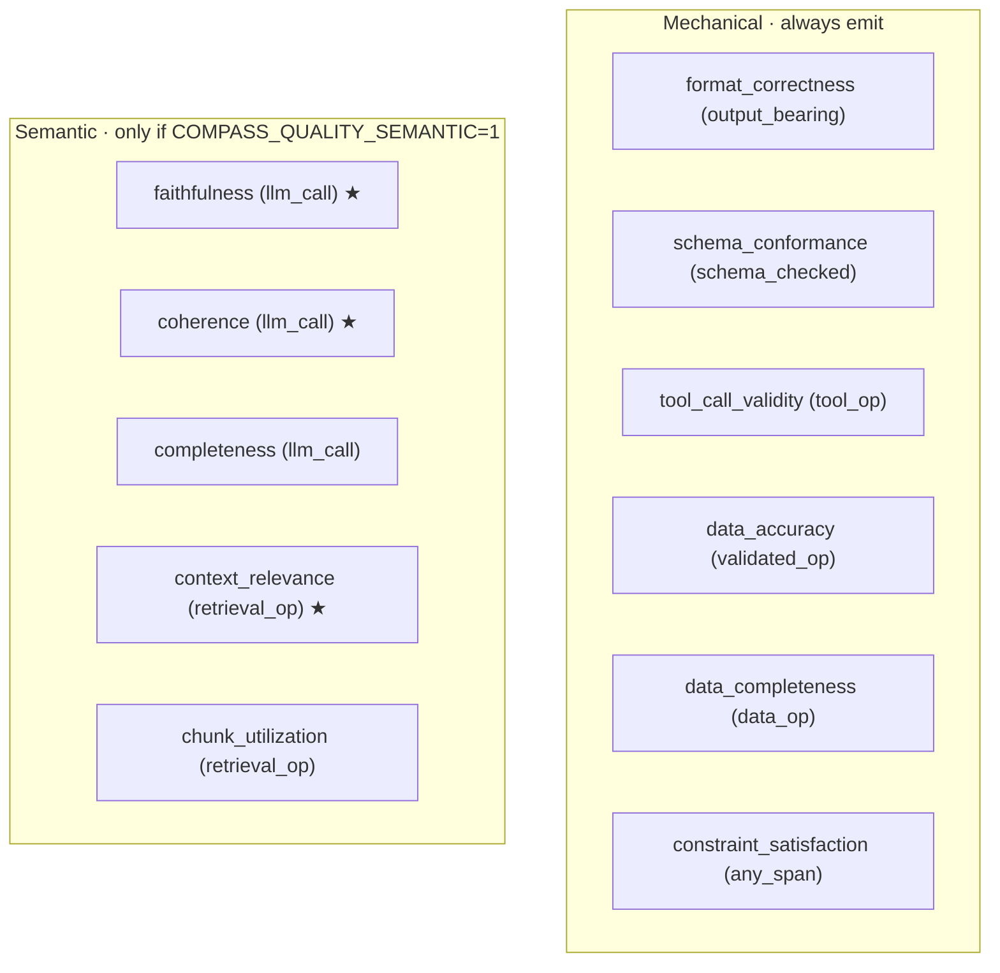
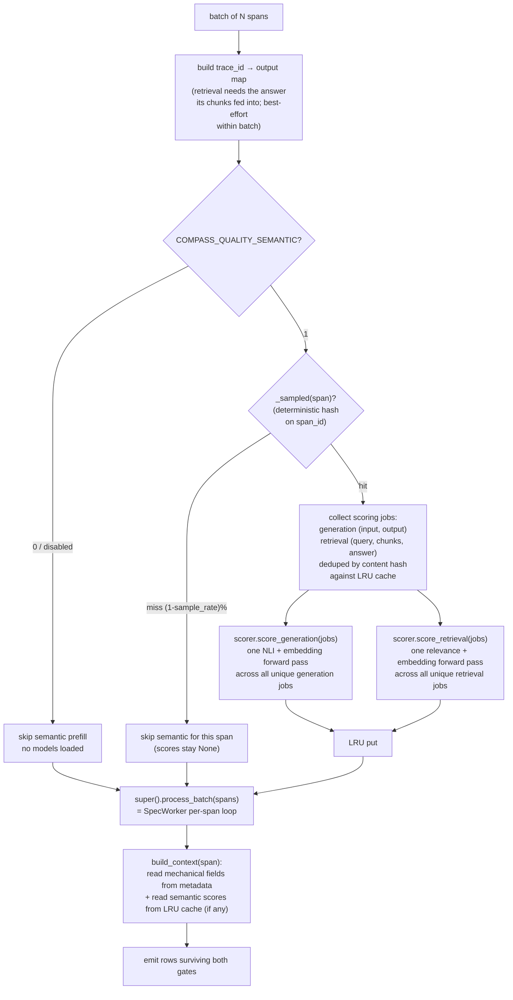
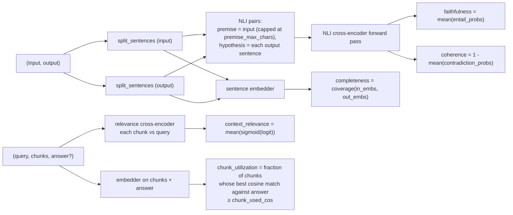
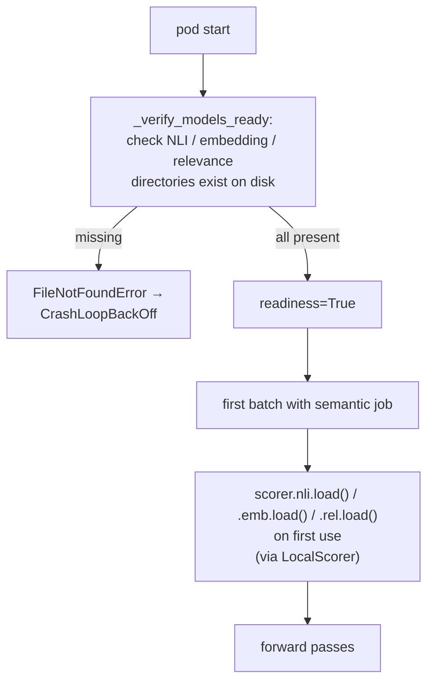
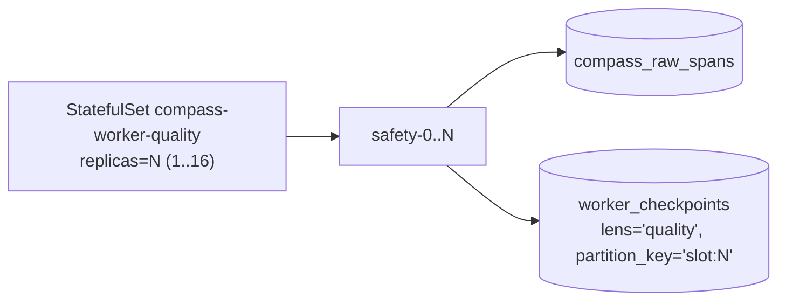
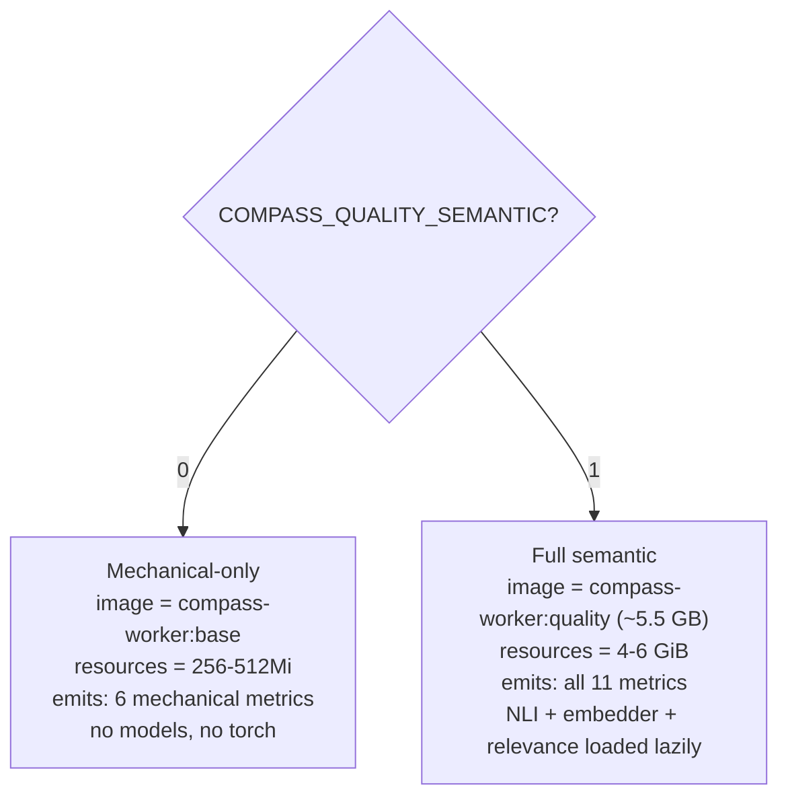

# Quality Lens — Architecture

11 metrics: 5 semantic (NLI + embedding + relevance cross-encoder) + 6 mechanical (read from span metadata, no ML). Two operating modes: full semantic, or mechanical-only (no torch, no GPU, fast).

## 1. Position

## 2. Metrics

★ = `threshold=True`. Mechanical metrics are all also `threshold=True`.

## 3. Per-batch flow

### Sampling

`COMPASS_QUALITY_SAMPLE=0.2` ⇒ score a deterministic **20% of spans** based on `hash(span_id) % 100 < 20`. Same set across reruns. Mechanical metrics emit at 100% — only semantic models pay the cost.

## 4. Scorer pipeline (`quality_observability` package)

One forward pass per model **across the entire batch's deduped jobs**. A batch of 5,000 spans with 100 unique system prompts becomes 100 generation jobs across one NLI forward + one embedder forward, not 5,000.

| Recipe knob | Default | Effect |
|---|---|---|
| `premise_max_chars` | 2000 | Cap on input fed to NLI as premise |
| `max_sents` | 10 | Cap on sentences kept per side |
| `sent_min_chars` | 3 | Min sentence length kept |
| `chunk_used_cos` | 0.5 | Cosine threshold for "answer used this chunk" |

## 5. Mechanical metrics (no ML)

| Metric | What it reads | When |
|---|---|---|
| `format_correctness` | `metadata.format_valid` bool | Output-bearing spans |
| `schema_conformance` | Compares `metadata.output` to `metadata.expected_schema` (or `.response_schema` / `.schema`) | Model_call with declared schema or validation span |
| `tool_call_validity` | `metadata.tool_call_valid` bool | tool_call spans |
| `data_accuracy` | `metadata.valid` + `metadata.errors[]` | validation spans |
| `data_completeness` | `metadata.completeness_ratio` | validation / skill_exec |
| `constraint_satisfaction` | `metadata.constraints` (rule object) — only computed when present | any span |

All cheap — no models needed. The Quality worker can run in mechanical-only mode (`COMPASS_QUALITY_SEMANTIC=0`) with the bare `:base` image; the heavyweight `:quality` image is only for full semantic scoring.

## 6. Lazy model loading + health check

The startup health check catches "Quality silently emits zero semantic rows because models failed to load" — fails loud at boot instead of silently never emitting.

## 7. Caching

| Cache | Size | Eviction | Why |
|---|---|---|---|
| ToggleCache | small | TTL 300s | Standard |
| Scoring LRU (`self._cache`) | `COMPASS_QUALITY_CACHE_MAX` = 20,000 | LRU, thread-safe | Same prompts repeat across thousands of spans |
| Model weights | on disk + RAM | pod lifetime | Bake-into-image |

Cache key = `sha256(text or json blob)[:16]`. The LRU is shared across generation and retrieval — different shapes hashed independently.

## 8. Topology + scaling

Same partition model as Safety. `cityHash64(trace_id) % 16` → slot ownership → per-slot checkpoints. Scale with `scale-quality.ps1 -Replicas N`.

| Pods | Slots/pod | Use |
|---|---|---|
| 1 | 16 | mechanical-only mode |
| 2 | 8 | low semantic load |
| 4 | 4 | typical prod with sampling |
| 8 | 2 | high semantic load |
| 16 | 1 | max — every slot has its own pod |

| Resources | Request | Limit |
|---|---|---|
| CPU | 1000m (CPU-only inference) | 4000m (NLI on CPU is the bottleneck) |
| Memory | 4Gi | 6Gi |
| GPU | optional — set `COMPASS_QUALITY_DEVICE=cuda` if available |

First-batch latency on CPU: cold NLI load + embedder load + relevance load = 5–15 s. Once warm, ~200 ms / job dominated by NLI forward.

## 9. Operating modes

Mechanical-only is the fast lane for "is the structure right" coverage. Semantic adds "is the content right".

## 10. Failure modes

| Failure | Outcome |
|---|---|
| Model directory missing (image bake error) | Startup health check raises → CrashLoopBackOff → roll image |
| NLI returns NaN | `score_generation` returns None for that field → engine skips emit for that metric |
| Scorer batch OOM | Pod killed → restart. Reduce `COMPASS_QUALITY_BATCH` (default 32) or scale pods |
| Cache lock contention under high concurrency | Thread-safe OrderedDict with lock; minor cost. Visible as `compass_worker_batch_duration_seconds` p95 widening |
| Sampling makes a span's score never available | By design — `_sampled` is deterministic, so reruns produce the same set. Operators can lower `COMPASS_QUALITY_SAMPLE` to 1.0 to score everything |

## 11. Adding a quality metric

Mechanical:
- Add MetricSpec to `SPECS`, declare the metadata read in `build_context`.
- No image rebuild needed (mechanical-only path).

Semantic:
- Implement the scoring recipe in `quality_observability.pipeline`.
- Cache the result in `build_context` and route to ctx field.
- Declare MetricSpec.
- May require a new model artifact — update `Dockerfile.quality` to include it.

In both cases: redeploy reconciler first to update `metric_catalog` + thresholds, then redeploy quality.
