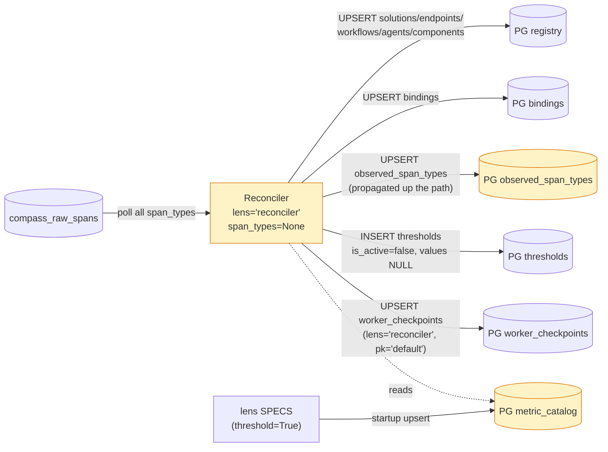
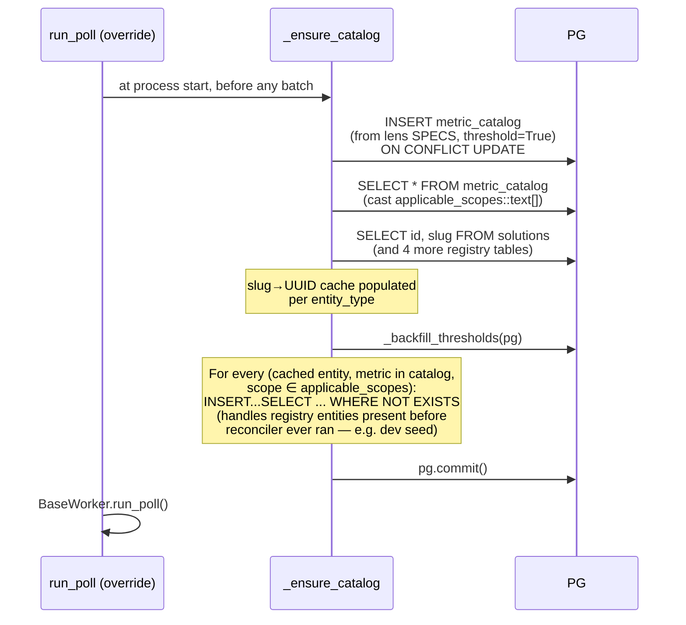
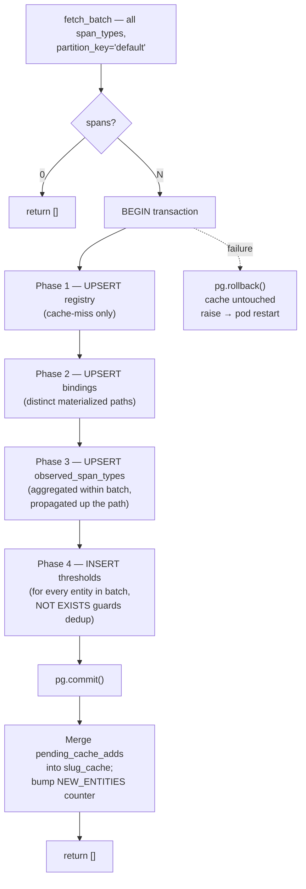
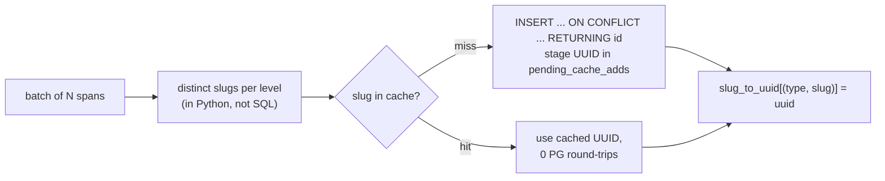
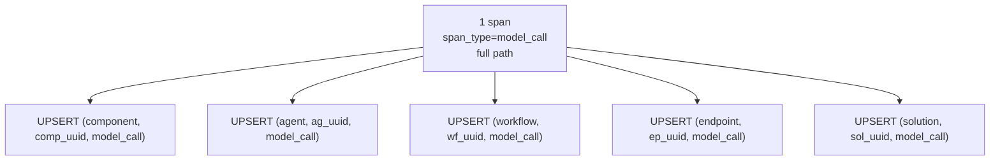
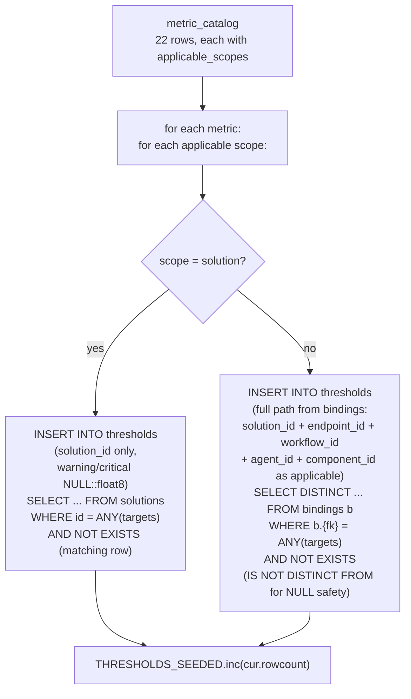
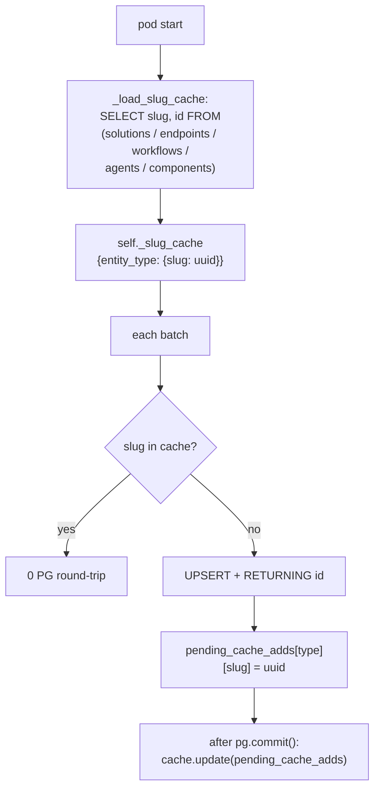
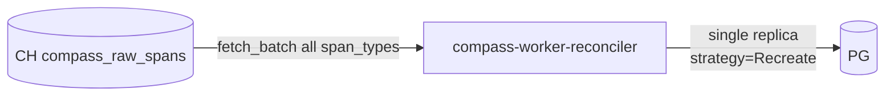
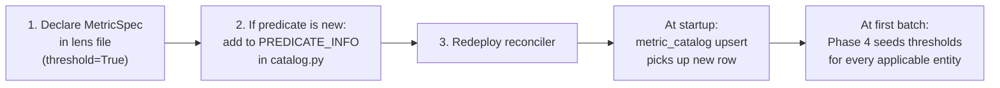

# Reconciler — Architecture

Auto-discovers entities, records evidence, seeds threshold rows. Read-only on ClickHouse; write-only on Postgres. Returns `[]` from `process_batch` — emits nothing to `compass_derived_metrics`.

## 1. Position in the system



Yellow = new in coverage feature. Other PG tables existed before.

## 2. Startup sequence



`metric_catalog` upsert is **idempotent** — `ON CONFLICT (metric) DO UPDATE` refreshes every column. Re-deploy with a new metric and the next pod start picks it up.

`load_metric_catalog` casts `lens::text` and `applicable_scopes::text[]` in the SELECT — psycopg has no default adapter for custom-enum arrays. Defensive `isinstance(..., list)` assertion fails loud if that cast is ever removed.

## 3. Per-batch flow



Single PG transaction per batch. Cache only updates **after** commit succeeds; rollback leaves it untouched so the next batch retries cleanly.

### Phase 1 — registry UPSERTs (cache-miss only)



Order is fixed because of FKs: solutions → endpoints (FK on solutions) → workflows → agents → components. Endpoints also set `path = endpoint_id` so the ToggleCache's `e.path` lookup finds the same string spans carry.

### Phase 2 — bindings

One distinct row per `(solution_id, endpoint_id, workflow_id, agent_id, component_id)` 5-tuple seen in the batch. UNIQUE index with `NULLS NOT DISTINCT` makes ON CONFLICT idempotent.

### Phase 3 — observed_span_types



Propagation makes the Phase 2 coverage view a single join — no recursive walk. Within one batch, all rows for the same `(entity, span_type)` are aggregated in Python first → one UPSERT per distinct key (5,000 spans → ~10-30 UPSERTs).

`sample_count` increments by the per-batch count; `last_seen = NOW()` always; `first_seen = NOW()` on INSERT only.

### Phase 4 — threshold seeding



**Full ancestor path** is populated, not just the deepest FK. The CHECK constraint permits this at all non-solution scopes ("optional"), and the ToggleCache builds its key from the full path so spans match. One threshold row per distinct binding path the entity participates in.

**NOT EXISTS uses `IS NOT DISTINCT FROM`**, not `=`, because some binding fields (workflow_id, agent_id) can be NULL. Plain `=` returns NULL for NULL operands → NOT EXISTS returns true → re-insert on every run → unbounded growth. `IS NOT DISTINCT FROM` treats NULL as a value.

**NULL literals cast to `::float8`** in the SELECT — `INSERT...SELECT` doesn't always coerce bare `NULL` to the target column type (especially with `SELECT DISTINCT`).

## 4. Caching



| Cache | Bounded by | Eviction |
|---|---|---|
| `metric_catalog` (`self._catalog`) | catalog size (~22 rows) | None — pod lifetime |
| Slug → UUID (`self._slug_cache`) | total registry cardinality (~thousands) | None — pod lifetime; pod restart reloads |

No TTL. Registry entries don't disappear (admin soft-deletes via `is_active=false` leave the row in place; we don't read `is_active` for cache validity). Pod restart reloads from PG.

## 5. Steady-state SQL cost per batch

5,000 spans, all referencing entities already in the cache:

| Phase | SQL statements |
|---|---|
| 1 — registry | 0 (all cache hits) |
| 2 — bindings | ~5–10 UPSERTs (distinct paths) |
| 3 — observed_span_types | ~10–30 UPSERTs (distinct (entity, span_type) within batch) |
| 4 — thresholds | ~22 metrics × ~3 avg scopes = ~66 `NOT EXISTS`-guarded INSERTs, ~0 rows inserted |
| checkpoint | 1 UPSERT |

~70–100 round-trips per 5,000 spans. The Phase 4 NOT EXISTS scans are indexed lookups; sub-100 ms total.

First batch after pod start: same shape, but Phase 4 may insert many rows for any newly-bound entities. Backfill at startup catches the rest (registry entities present before the reconciler had a chance to seed them).

## 6. Topology + scaling



| Knob | Value | Why |
|---|---|---|
| `replicas` | 1 | Two reconcilers race on UPSERTs |
| `strategy` | Recreate | Old pod terminated before new pod starts — guarantees single writer |
| `WORKER_PARTITION_COUNT` | unset | unpartitioned (`my_slots = [None]`) — reads all rows |
| Resources | 100m / 256Mi req, 500m / 512Mi lim | PG-bound, not CPU-bound |

The work is small and bursty — most batches in steady state are cheap. Spike on first deployment processing the 90d backlog; recovers automatically via the worker's "drain mode" (no sleep between full batches).

## 7. Observability

Adds to the standard worker metrics:

| Metric | Labels | Increments |
|---|---|---|
| `compass_reconciler_new_entities_total` | `entity_type` | After successful commit, per type of entity inserted via cache-miss |
| `compass_reconciler_thresholds_seeded_total` | `lens, scope` | Per `cur.rowcount` from each Phase 4 INSERT |

`compass_worker_checkpoint_lag_seconds{lens="reconciler"}` is the main health signal. Steady at 0–10s ≈ fine. Climbing without bound ≈ spans arriving faster than PG can keep up (unusual; PG is fast).

## 8. Failure modes

| Failure | Outcome |
|---|---|
| Partial commit failure | Whole batch rolled back, cache untouched, pod restart re-fetches from previous checkpoint |
| Two reconcilers running concurrently (e.g. manual `kubectl scale`) | Both try UPSERTs; UNIQUE constraints + ON CONFLICT serialize them — no data corruption, just wasted work. **Strategy=Recreate prevents this.** |
| Registry row deleted by admin while reconciler running | Cache stale → next batch's INSERT references missing FK → transaction fails → rollback. Pod restart reloads cache from PG. Mitigation: don't hard-delete; use `is_active=false` |
| `metric_catalog` table dropped | Catalog upsert at next pod start recreates it from SPECS. Until then, Phase 4 skips |
| `observed_span_types` corrupted | Phase 3 keeps writing fresh; coverage views fall back to "dark" if evidence missing. Run reconciler against the 90d backlog to rebuild |
| Skill files missing | Not applicable — reconciler has no model dependencies |

## 9. Adding a new metric / lens



Missing the predicate registration is a deploy-time error — `build_catalog_rows()` raises before the first batch.

## 10. State after reconciler runs

```
PG state                       Source
─────────────────────────────  ─────────────────────────────────────
solutions / endpoints / ...    Reconciler Phase 1 (auto-discovered)
bindings                        Reconciler Phase 2
observed_span_types             Reconciler Phase 3
thresholds (is_active=false)   Reconciler Phase 4 + backfill
thresholds (is_active=true)    User action via Coverage UI
metric_catalog                  Reconciler startup (from lens SPECS)
worker_checkpoints (reconciler) Reconciler save_checkpoint
```

Lens workers don't write to PG except `worker_checkpoints`. Reconciler doesn't write to CH at all.
