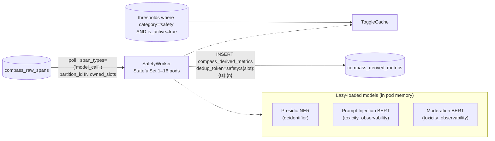
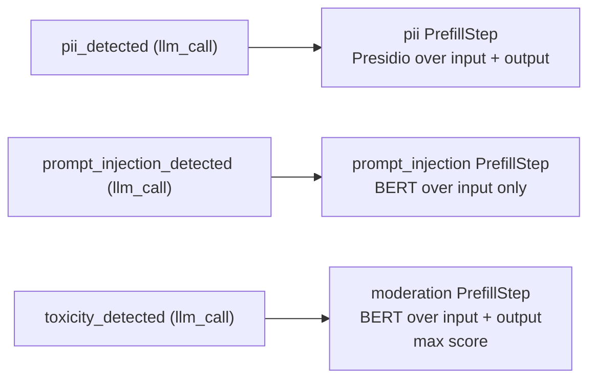
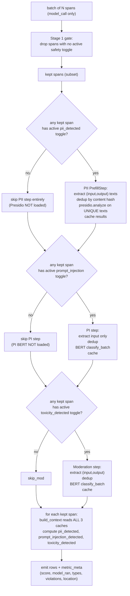
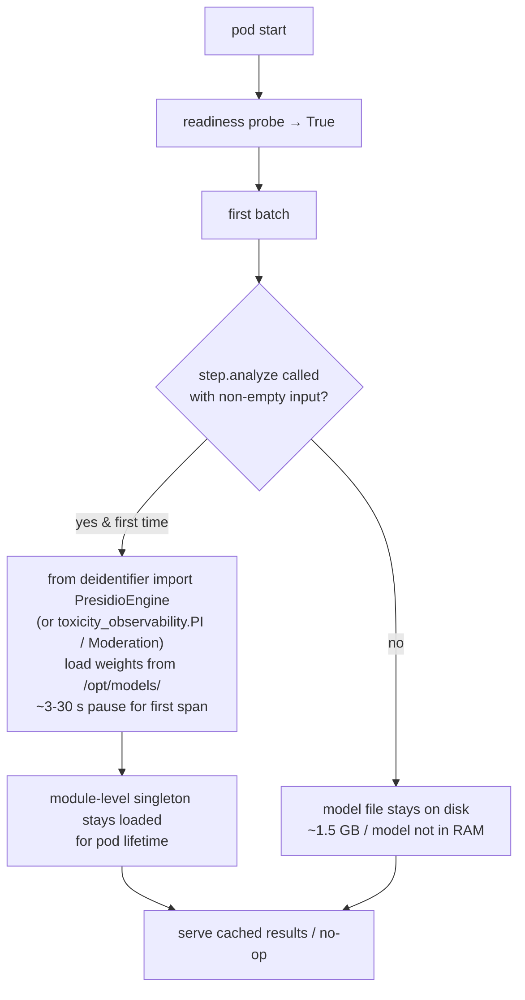
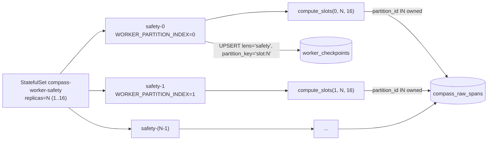

# Safety Lens — Architecture

3 metrics. Heavy ML: Presidio NER for PII + 2 DeBERTa-class ONNX classifiers for prompt-injection and moderation. Runs as a partitioned StatefulSet with 1–16 replicas.

## 1. Position



## 2. Metrics



All three are `threshold=True`. Pre-filter at CH: `span_types = ('model_call',)` — only LLM generation spans carry text worth analyzing.

## 3. Per-batch flow — PrefillStep pipeline



### Three-level efficiency

1. **CH-side prefilter** — `span_types=('model_call',)` ensures non-LLM spans never load into memory.
2. **Stage 1 gate** — drops spans for which no Safety toggle is active. If a customer has only PII enabled on solution X, only X's `model_call` spans reach the ML stack.
3. **PrefillStep sub-filtering** — each step gets only the spans whose threshold metric matches `step.metrics`. A pod that never sees an active `toxicity_detected` toggle never loads the moderation BERT.
4. **Content-hash dedup** — within and across batches, the same prompt is analyzed once. LRU cache (size `COMPASS_PII_CACHE_MAX` / `COMPASS_TOXICITY_CACHE_MAX`); hit rate is 95%+ on established workloads (system prompts repeat across thousands of spans).

## 4. Lazy model loading



A Safety pod whose customer has only PII enabled never loads the toxicity models — saves ~1 GB of RAM.

## 5. Model artifacts

Baked into the `compass-worker:safety` image (~5.5 GB) at `/opt/models/`:

| Model | Source | Size |
|---|---|---|
| Presidio NER (spaCy) | `en_core_web_sm` baked in | ~220 MB |
| Prompt Injection BERT | HF snapshot, ONNX | ~500 MB |
| Moderation BERT | HF snapshot, ONNX | ~500 MB |

**Why bake into image** (vs init container + PVC): zero model-fetch on pod boot, image SHA pins weights to a reproducible deploy, no HF outage risk at runtime. Cost: 5.5 GB image pulled once per node, amortized across pod restarts.

## 6. Topology + scaling



| Pods | Slots per pod | When |
|---|---|---|
| 1 | 16 | low traffic / dev |
| 2 | 8 | early prod |
| 4 | 4 | moderate prod |
| 8 | 2 | high prod |
| 16 | 1 | max parallelism (1 slot per pod) |

### Slot derivation

`compass_raw_spans.partition_id = cityHash64(trace_id) % 16` is materialized at ingest. Set skip index makes per-slot fetches scan only relevant data parts. Each pod's `compute_slots(idx, count, total=16)` returns its owned subset.

### Scale up / down

```bash
# Atomically patches replicas AND WORKER_PARTITION_COUNT, watches rollout
./infra/k8s/scale-safety.ps1 -Replicas 8
```

Slot checkpoints persist across changes — a new pod inheriting slot 7 reads slot 7's row from `worker_checkpoints` and resumes. **No manual rebalancing.**

| Resources | Request | Limit |
|---|---|---|
| CPU | 1000m | 2000m |
| Memory | 4Gi | 6Gi (incl. ~1.5 GB model + LRU caches) |

## 7. Caching

| Cache | Size | TTL | Eviction |
|---|---|---|---|
| ToggleCache | small | 300s | TTL refresh |
| PII results LRU | `COMPASS_PII_CACHE_MAX` (~10k) | none | LRU |
| PI results LRU | `COMPASS_TOXICITY_CACHE_MAX` (~10k) | none | LRU |
| Moderation results LRU | `COMPASS_TOXICITY_CACHE_MAX` (~10k) | none | LRU |
| Model weights | `/opt/models/` | pod lifetime | none |

Content hash = `sha256(text)[:16]` — short enough for dict keys, long enough that collisions don't matter.

## 8. Observability

Standard worker metrics + watch:

| Metric | Watch for |
|---|---|
| `compass_worker_checkpoint_lag_seconds{lens="safety"}` | Climbing → scale up |
| `compass_worker_batch_duration_seconds{lens="safety"}` | p95 > poll_sec → scale up |
| `compass_worker_batches_total{lens="safety", result="error"}` | Persistent errors → check model load, OOM |

HPA driver (when ready):

```yaml
metrics:
- type: Pods
  pods:
    metric: { name: compass_worker_checkpoint_lag_seconds }
    target: { type: AverageValue, averageValue: "60" }
```

Target = "keep average lag under 60s across all Safety pods".

## 9. Failure modes

| Failure | Outcome |
|---|---|
| Model file corrupt / missing | `_verify_models_ready` at construction raises clear error; pod CrashLoopBackOff. Roll back image |
| OOM during ML inference | Pod killed, restarted. If recurring → increase memory limit or scale up (fewer spans per pod) |
| Tokenizer fails on weird input | One span errors → whole batch rolls back → next batch retries forever. **Fix forward** — patch the lens to catch and emit "scoring_failed" meta |
| Two Safety pods owning same slot (manual `kubectl scale` desync) | Both fetch same spans, both try to write. Dedup tokens (`safety:s{slot}:{ts}:{n}` are identical) make CH drop one — correctness preserved, compute wasted |
| First batch after pod restart is slow | Models cold-load on first non-empty input. 3–30s pause. Readiness probe stays True throughout, but checkpoint lag spikes |

## 10. Adding a Safety metric

Adding a new prefill step (new model):

1. Implement the analyzer (mirroring `deidentifier` / `toxicity_observability` package shape).
2. Add a `PrefillStep` in `SafetyWorker.__init__`.
3. Declare specs with the appropriate metric names; add to the relevant METRICS set so sub-filtering works.
4. Cache + lazy load follow automatically.

Adding a metric over an existing step:

1. Declare spec in `SPECS`.
2. Add metric name to the right METRICS set (`PII_METRICS` / `PROMPT_INJECTION_METRICS` / `MODERATION_METRICS`).
3. Have `build_context` map cached step output to the new metric.

In both cases: redeploy reconciler first (so metric_catalog + thresholds seed), then redeploy safety.
