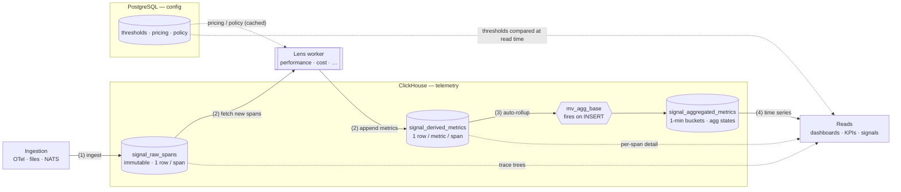

# Signal — Technical Architecture

**Scope of this document:** everything built so far — the two data stores, the
end-to-end telemetry flow, the three ClickHouse tables and their aggregation
layer, the worker framework (spec engine, scoping, watermarks), the two lenses
(Performance, Cost), the caching and filtering optimizations, and an honest
production-readiness assessment.

Audience: an engineer picking this up cold. Read alongside **README.md** (how to
run) and the schema files (`signal_pg_schema_v5.sql`, `signal_ch_ddl_v2.sql`).

---

## 1. The two halves

Signal is an observability system for AI-agent solutions. It separates
**configuration** from **telemetry**, and the split is the single most important
idea in the system:

| | PostgreSQL (config side) | ClickHouse (telemetry side) |
|---|---|---|
| Answers | what **exists** and what **should be** | what **happened** |
| Holds | registry (solutions, endpoints, workflows, agents, components), bindings (what's wired to what), thresholds (alert limits), pricing | raw spans, computed metrics, pre-aggregated time series |
| Shape | normalized, relational, small | denormalized, columnar, huge |
| Changes | rarely (config edits) | constantly (every request) |

The **API/signal layer** bridges them: it reads a threshold from Postgres ("p95
latency must stay under 2s"), reads the current value from ClickHouse, compares,
and emits a signal. The **workers** (this codebase) are the piece that turns raw
spans into the measured values ClickHouse serves.

---

## 2. End-to-end data flow



> Numbers `(1)–(4)` mark the four stages described below. Solid arrows are the
> write path (spans in → metrics out → rolled up); dotted arrows are reads and
> config lookups. The three ClickHouse tables never JOIN — they share
> `span_id`/`trace_id` and are queried independently.

1. **Ingestion** writes one immutable row per span into `signal_raw_spans`. A
   span is a unit of work in a trace (an LLM call, a tool call, a retrieval, an
   agent step…). Per-span payload (token usage, IO text, retrieval chunks, error
   detail, perf attributes) lives in a single JSON `metadata` blob.
2. **A lens worker** reads new spans, computes its metrics, and appends EAV rows
   to `signal_derived_metrics` (one row per metric per span).
3. **A materialized view** (`mv_agg_base`) fires on every insert into the derived
   table and writes pre-aggregated 1-minute buckets into
   `signal_aggregated_metrics`. No cron, no batch job.
4. **Reads** hit the aggregated table for dashboards/KPIs, the derived table for
   per-span detail, or the raw table for full trace trees. Thresholds/policies
   from Postgres are compared against these values to produce signals.

The three tables don't JOIN in production — they share `span_id`/`trace_id` for
traceability but are queried independently.

---

## 3. The ClickHouse tables (`signal_ch_ddl_v2.sql`)

### 3.1 `signal_raw_spans` — "what happened"

- **Engine:** `MergeTree`
- **Partition:** `toYYYYMM(started_at)` (monthly)
- **Order key:** `(solution_id, span_type, started_at, trace_id, span_id)`
- **TTL:** 90 days from `started_at`

25 columns. Lean and denormalized: the entity path (`solution_id`, `endpoint`,
`workflow_id`, `agent_id`, `component_id`, `component_type`), classification
(`span_type`, `span_status`, `scope`), timing (`started_at`, `ended_at`),
infra (`service`, `environment`, `region`), and one `metadata` String
(`CODEC ZSTD(3)`) holding everything else. Descriptor fields (model name,
provider, temperature…) are **not** stored — they're derivable from
`component_id` via Postgres.

> Note `span_type` is the **second column of the order key**. That's what makes
> the Cost lens's `WHERE span_type IN (...)` filter cheap — see §7.2.

### 3.2 `signal_derived_metrics` — "what was measured"

- **Engine:** `MergeTree`
- **Partition:** `toYYYYMMDD(ts)` (daily)
- **Order key:** `(solution_id, scope, metric, ts, component_id)`
- **TTL:** 90 days from `ts`

EAV (entity-attribute-value): one row = one metric measurement attached to one
span. 18 columns: the entity path + `scope` + `environment`, plus
`ts`/`metric`/`value`/`confidence`/`metric_meta` and the `start_ts`/`end_ts`
range. `trace_id` and `parent_span_id` are denormalized in so per-trace queries
need no join back to raw.

Workers **only ever write here.** Append-only.

### 3.3 `signal_aggregated_metrics` — "the pre-rolled time series"

- **Engine:** `AggregatingMergeTree`
- **Partition:** `toYYYYMM(ts)` (monthly)
- **Order key:** `(solution_id, scope, metric, ts, workflow_id, agent_id, component_id, component_type, environment)`
- **TTL:** 365 days from `ts`

This is the **primary read table for the UI**, and it's the subtle one. It stores
**aggregate-function states**, not finished numbers:

| Column | Type | Read with |
|---|---|---|
| `count`, `sum_value`, `min_value`, `max_value` | `SimpleAggregateFunction` | read directly; re-apply `sum/min/max` when grouping |
| `avg_value` | `AggregateFunction(avg, Float64)` | `avgMerge(avg_value)` |
| `quantiles` | `AggregateFunction(quantilesTDigest(0.5,0.95,0.99), Float64)` | `quantilesTDigestMerge(...)(quantiles)` → `[p50,p95,p99]` |
| `avg_confidence` | `AggregateFunction(avg, Nullable(Float32))` | `avgMerge(avg_confidence)` |

**Why states instead of finished averages:** percentiles and averages don't sum.
You can't average two pre-averaged buckets and get the right answer, and you
certainly can't add two p95s. By storing the *intermediate aggregate state*
(a t-digest sketch for quantiles, a sum+count pair for avg), ClickHouse can merge
any set of base buckets into a correct coarser-window result at read time.

**The gotcha:** selecting a state column raw prints binary garbage. You must read
through the matching `-Merge` combinator with a `GROUP BY` (see README §8).

### 3.4 The aggregation layer — one base grain, merged on read

There is exactly **one** materialized view, `mv_agg_base`, at a **1-minute** base
grain. It fires on every insert into `signal_derived_metrics`:

```
INSERT into signal_derived_metrics
        │
        ▼
   mv_agg_base   ── groups by (entity path, scope, metric, 1-min bucket)
        │           and writes count/sum/min/max + avgState + quantilesTDigestState
        ▼
signal_aggregated_metrics   (one row per entity × metric × minute)
```

Coarser windows (5m, 1h, 1d) are **not separate tables or views** — they're
produced by merging base-grain buckets at read time:

```sql
-- 1h view = merge 60 one-minute buckets
SELECT toStartOfHour(ts) AS hour,
       avgMerge(avg_value),
       quantilesTDigestMerge(0.95)(quantiles)
FROM signal_aggregated_metrics
WHERE metric = 'latency' AND solution_id = 'sol_support'
GROUP BY hour;
```

This is why there's no `window` column: the grain is fixed at the base, and the
window is a read-time choice. (To support sub-minute live tailing, change the MV's
`INTERVAL 1 MINUTE` to `30 SECOND`; the rest is unaffected.)

---

## 4. The worker framework

### 4.1 Code arrangement: engine vs lens

The package is deliberately split into a **shared engine** and **thin lenses**:

```
signal_worker/
  base.py        ENGINE  — run loop, ClickHouse I/O, watermark, CSV/NATS paths
  spec.py        ENGINE  — MetricSpec + SpecWorker (build-context → walk-specs → emit)
  patterns.py    SHARED  — the handful of compute shapes (~6) every metric reuses
  predicates.py  SHARED  — the "which spans" filters
  pricing.py     SHARED  — PricingCache (Cost and later lenses)
  lenses/
    performance.py  LENS — 17 specs + build_context
    cost.py         LENS — 22 specs + build_context (+ span_types filter)
```

The guiding principle: **a metric is a thin declarative spec over a small shared
compute library, plus a per-span context built once.** ~100 metrics across the
five lenses collapse to ~6 compute patterns, so the patterns are written once and
reused; the per-span context (parse metadata, do the pricing math, etc.) is built
once per span and every spec reads off it. Adding a metric is usually one line.

### 4.2 The spec model (`spec.py`)

```python
@dataclass
class MetricSpec:
    metric: str          # e.g. "latency"
    lens: str            # "performance"
    applies: Callable    # (span) -> bool          — a predicate
    pattern: Callable    # (span, ctx) -> float|None — a compute pattern
    inputs: list         # documentation: what it reads
    unit: str            # "ms", "USD", "count", ...
    window: str          # rollup window hint ("5m", "1h", "1d")
    threshold: bool      # does Postgres define an alert for it
    per_span: bool       # False => computed at READ time, not by the worker
```

A spec is **pure declaration** — no logic. `applies` and `pattern` are functions
picked from `predicates.py` and `patterns.py`. A `pattern` returning `None` means
"nothing to emit for this span" (e.g. an absent metadata key, or a divide-by-zero
guard) — the engine simply skips it.

**Patterns** (`patterns.py`) are the reusable compute shapes, e.g.
`column_latency` (ended − started), `status_flag(set)` (1/0 from `span_status`),
`metadata_numeric(key)` / `metadata_bool(key)` (pull from the JSON blob),
`ratio(num, den)`, `ctx_value(field)` (read a value the context-builder already
computed), and `aggregation_derived()` (a marker for read-time metrics — always
returns `None`).

**Predicates** (`predicates.py`) are the "which spans" filters, e.g. `any_span`,
`llm_call` (`span_type == 'model_call'`), `billable`
(`model_call|embedding|tool_call|retrieval`), `retryable`, `rate_limited`,
`batch_op`, `sol_wf`, etc.

### 4.3 The engine (`SpecWorker.compute`)

For each span the engine does:

```
compute(span):
  if span_types set and span.span_type not in span_types:  return []   # cheap reject
  ctx = build_context(span)              # lens-specific: parse metadata, do math, ONCE
  for scope in scopes_for(span):         # usually one; a solution span also mirrors to endpoint
      p = path_cols(span, scope)         # blank ids deeper than this scope
      for spec in specs:
          if not spec.per_span:    continue   # read-time metrics aren't emitted here
          if not spec.applies(span): continue
          val = spec.pattern(span, ctx)
          if val is None:           continue   # nothing to emit
          rows.append(row(p, span, spec.metric, val))
  return rows
```

`build_context` runs **once per span** even though many specs read from it — that's
the whole efficiency idea (parse the metadata once, do the pricing math once;
later, for Quality, make one judge call that several metrics share).

### 4.4 Scoping and the materialized path

Every derived row carries the full entity path, and the **scope** says which level
the metric is *about*. The convention (shared with the Postgres bindings/thresholds
side): **the deepest non-empty id is the target; higher levels are context.**

`path_cols(span, scope)` enforces this by blanking ids deeper than the scope:

| scope | keeps | blanks |
|---|---|---|
| solution / endpoint | solution_id (+endpoint) | workflow, agent, component |
| workflow | + workflow_id | agent, component |
| agent | + agent_id | component |
| component | full path | — |

`scopes_for(span)` returns the scope(s) a span emits at — normally just its own,
but a root `solution` span also **mirrors to `endpoint`** so endpoint-scoped
dashboards have data.

### 4.5 The run loop (`BaseWorker`)

```
run_poll():
  loop:
    wm    = load_watermark()                         # file: state/<lens>.watermark
    spans = fetch_batch(since=wm, limit=batch)        # recorded_at > wm ORDER BY recorded_at
    for s in spans: out += compute(s); track newest recorded_at
    write(out)                                        # single bulk insert into derived
    save_watermark(newest)                            # restart-safe checkpoint
    if --once: break  else sleep(poll_sec)
```

Three entry paths share the **same** `compute()`:

- **`run_poll`** — production-ish: poll ClickHouse by a `recorded_at` watermark.
- **`run_csv`** — offline: run the identical logic over an exported spans CSV, no
  database. This is how every lens is validated.
- **`on_message`** — a NATS-shaped hook for an event-driven future (subscribe to
  span events → compute → write).

**ClickHouse connection is lazy** — imported/opened only when actually used — so
the offline CSV path needs no driver installed.

### 4.6 Watermarks — one per lens

The checkpoint file is keyed by lens name: `state/performance.watermark`,
`state/cost.watermark`. Consequences:

- Lenses are fully independent: reset, crash, or lag one without touching another.
- Each new lens **backfills the full history independently** on first run (its
  watermark starts at `1970-01-01`).
- Restart-safe: a killed worker resumes from its last saved watermark.

---

## 5. The lenses built so far

### 5.1 Performance — 17 metrics (14 per-span + 3 read-time)

Sub-categories: Latency, Throughput, Errors, Retry/resilience. Three metrics
(`throughput`, `concurrency`, `messages_in_flight`) are **read-time** (gauges /
rates over a window), so they're declared with `aggregation_derived()` and not
emitted per span. Categorical descriptors (`error_type`, `error_code`,
`http_status_code`, …) stay in `metadata` rather than becoming metric rows.

`build_context` extracts `latency_ms`, status, the metadata blob, and `usage`
once. The deterministic three (`latency`, `error_rate`, `timeout_count`) come from
the span's own columns; the rest (`time_to_first_token`, `queue_wait_time`,
`retry_count`, `rate_limit_hit`, `records_processed`, …) are extracted from
metadata attributes the runtime records.

Performance reads **every** span (`span_types = None`) because latency/error apply
to all of them.

### 5.2 Cost — 22 metrics (16 per-span + 6 read-time)

Sub-categories: Token consumption, Monetary, Efficiency, Budget/forecasting.

**Cost is additive** — and that drives the whole design. Monetary spend originates
only at the **billable component leaf spans** (`model_call`, `embedding`,
`tool_call`, `retrieval`). Solution / agent / workflow cost is **not fabricated
per span** — it's obtained by **summing** the component costs at read time
(`sum(sum_value)` in the aggregated table). The 6 read-time metrics
(`cost_per_outcome`, `cost_per_record`, `budget_utilization`, `burn_rate`,
`projected_cost`, `infrastructure_cost`) are sums/ratios over a window, not
properties of a single span.

`build_context` does the pricing math **once** per billable span: pull `usage`
from metadata → look up rates from the `PricingCache` → compute
`cost = input_tokens/1000·input_rate + output_tokens/1000·output_rate` (tool →
`per_call`, kb → `per_query`), plus `cache_savings`, `wasted_cost`, `retry_cost`,
`cost_per_token`. Every cost spec is then a one-line `ctx_value(field)` read.

Validated against the reference data: `cost`, `input_cost`, `output_cost`, and the
token counts reproduce it **100% exactly**.

---

## 6. Pricing: where config meets telemetry (`pricing.py`)

The Cost lens needs prices, and prices live in Postgres `components.pricing`
(JSONB). The design:

- **Tiny, slowly-changing, read-every-span** → an **in-process cache**, not Redis.
  `PricingCache` loads *all* active components in one query, holds them in a dict,
  serves every span from memory, and refreshes the whole set on a TTL (default
  300s). A new/changed price is picked up within one TTL window.
- **Pluggable source** behind `PricingSource`: `PostgresPricingSource` (live),
  `StaticPricingSource` (offline/tests). A Redis-backed source or a pub/sub
  invalidation layer can be added later without touching the cost logic — worth it
  only if you run many replicas and want instant central invalidation.

This is the same shape the worker uses for any "config compared against telemetry"
metric — the Safety lens will reuse it for policies (required region, retention
schedule, consent requirement) to compute compliance.

---

## 7. Performance & efficiency design

Both optimizations below were proven **output-identical** before/after — pure
speedups, no behavior change.

### 7.1 The pricing cache must not hit the DB per span

Earlier the cache reloaded from Postgres whenever it was asked for an id it didn't
have — meant to catch newly-added components, but it backfired: 66% of spans
(solution/workflow/agent) ask for an empty `component_id`, which is never in the
table, so each one forced a Postgres round-trip (~11,400 needless queries per
run). Fix: a cache miss returns instantly; the TTL refresh is what picks up new
components. That alone made Cost as fast as Performance.

### 7.2 Read only the spans a lens can use

Cost can only produce metrics for billable spans, so `CostWorker` declares
`span_types = ("model_call","embedding","tool_call","retrieval")`. The engine
pushes this into the **fetch query** as `AND span_type IN (...)`. Because
`span_type` is the second column of the raw table's order key, ClickHouse skips
whole granules on the primary index — it never even reads the ~66% of spans Cost
doesn't need, cutting I/O *and* compute. (A `scope='component'` filter would only
cut compute, since `scope` isn't in the order key; `span_type` is the better
filter and is also the precise set.) Performance leaves `span_types` unset — it
genuinely needs every span.

### 7.3 The mechanical-vs-semantic split (and a SQL option)

Performance and Cost are **mechanical** — pure functions of columns + metadata.
For very large volumes their math could be pushed entirely into ClickHouse as
`INSERT … SELECT` (or raw→derived materialized views), processing server-side with
no Python round-trip. The Python worker stays the right tool for the **semantic**
lenses (Quality, Safety content checks) that need an LLM/classifier judge SQL
can't do. The spec registry would stay the source of truth either way. This is a
future option, only needed at scale; the per-span cache + span_type filter already
made the current volume fast.

---

## 8. One worker per lens (deployment model)

A lens is its own class **and** its own process. `run_worker.py <lens>` launches
exactly one lens per invocation; it's a dispatcher, not a process that runs all of
them. In production you run them as separate services:

```
python run_worker.py performance   # process 1 — own loop, own watermark, own replicas
python run_worker.py cost          # process 2 — independent
```

They **share a code library** (engine + patterns + predicates + pricing) but not a
runtime. The real axis is *compute class*: Performance/Cost are cheap arithmetic;
Quality/Safety are expensive model inference. Keeping them as separate processes
lets you scale the expensive ones independently. (You *can* co-locate the cheap
ones into one process later if you want — a deployment choice, not a code change.)

---

## 9. Production readiness — honest assessment

**Solid today**

- **Restart-safe** — file watermark per lens; a killed worker resumes cleanly.
- **Config-driven** — all connection/tuning via env vars, sane local defaults.
- **Lazy connections** — no driver needed for offline work; CH opened on first use.
- **Offline-validated** — identical `compute()` runs over CSV; each lens diffed
  against reference data (Performance and Cost both verified).
- **Independent lenses** — separate classes, processes, watermarks; isolated blast
  radius.
- **Index-aware reads + in-process pricing cache** — no per-span DB calls; reads
  only relevant spans.
- **Lifecycle by TTL** — raw/derived expire at 90d, aggregated at 365d; no cleanup
  jobs.
- **Self-maintaining rollups** — the MV produces aggregates on insert; no batch
  aggregation to schedule or babysit.

**Gaps to close before calling it fully production-grade**

- **Idempotency / exactly-once.** The derived table is append-only, so
  reprocessing the same spans (watermark reset, overlapping batches) **double
  counts** through the MV. Today's pattern is *truncate + reload* for a full
  backfill. For safe reprocessing, key derived rows by `(span_id, metric, scope)`
  and use a `ReplacingMergeTree`, or dedupe on insert.
- **Watermark tie at the batch edge.** `recorded_at > wm` with a `LIMIT` can skip
  rows that share the boundary timestamp if a tie spans the batch edge. Mitigated
  by a large batch; a robust fix is `(recorded_at, span_id)` cursor pagination.
- **Event-driven ingest** — `on_message()` is a stub; the NATS consumer isn't
  wired. Today it's poll-only.
- **Worker self-observability** — no metrics/health endpoint on the workers
  themselves (lag, throughput, error count). Add before running unattended.
- **Packaging** — no Dockerfile / per-lens entrypoints yet; runs from source.
- **Semantic scorer interface** — Quality and the content-safety half of Safety
  need a pluggable judge/scorer; deferred by design.

---

## 10. Entity model glossary (Postgres v5)

| Term | Meaning |
|---|---|
| **solution** | top-level product; everything is scoped under one |
| **endpoint** | entry point into a solution (`/api/v1/extract`, a cron, a queue) |
| **workflow** | reusable orchestration grouping agents |
| **agent** | reusable actor; its capabilities come from the components bound to it |
| **component** | unified registry for model / tool / skill / function / knowledgebase / memory (discriminated by `component_type`; `pricing`/`metadata` JSONB carry type-specific fields) |
| **binding** | a *use* row: "in this (solution, endpoint, workflow?, agent?) context, this asset runs with this config". Deepest non-NULL FK = the target |
| **threshold** | alert limit for a metric at a scope (`category` ∈ performance/quality/cost/safety/outcomes); warning + critical values |

The same materialized-path / deepest-non-null-is-the-target convention runs
through Postgres bindings/thresholds **and** the ClickHouse derived/aggregated
scope columns — one mental model across both stores.
